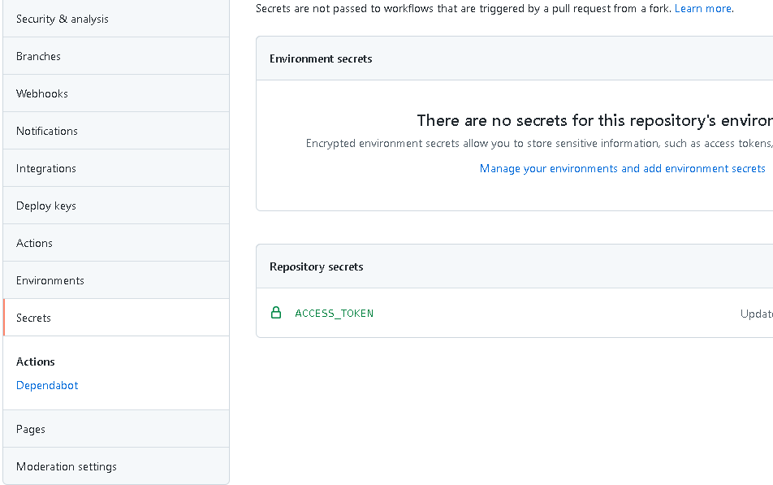
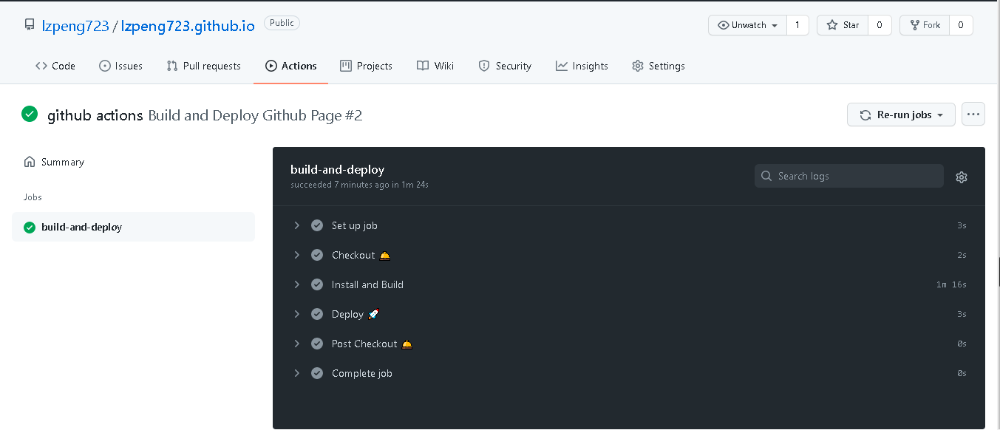
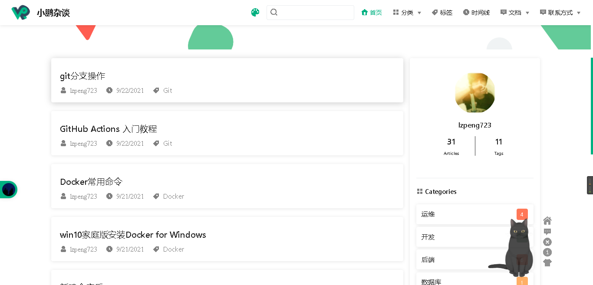

[参考链接]: http://www.ruanyifeng.com/blog/2019/09/getting-started-with-github-actions.html

# GitHub Actions 入门教程

## 一、GitHub Actions 是什么？

大家知道，持续集成由很多操作组成，比如抓取代码、运行测试、登录远程服务器，发布到第三方服务等等。GitHub 把这些操作就称为 actions。

很多操作在不同项目里面是类似的，完全可以共享。GitHub 注意到了这一点，想出了一个很妙的点子，允许开发者把每个操作写成独立的脚本文件，存放到代码仓库，使得其他开发者可以引用。

如果你需要某个 action，不必自己写复杂的脚本，直接引用他人写好的 action 即可，整个持续集成过程，就变成了一个 actions 的组合。这就是 GitHub Actions 最特别的地方。

GitHub 做了一个[官方市场](https://github.com/marketplace?type=actions)，可以搜索到他人提交的 actions。另外，还有一个 [awesome actions](https://github.com/sdras/awesome-actions) 的仓库，也可以找到不少 action。


上面说了，每个 action 就是一个独立脚本，因此可以做成代码仓库，使用```userName/repoName```的语法引用 action。比如，```actions/setup-node```就表示```github.com/actions/setup-node```这个仓库，它代表一个 action，作用是安装 Node.js。事实上，GitHub 官方的 actions 都放在 [github.com/actions](https://github.com/actions) 里面。

既然 actions 是代码仓库，当然就有版本的概念，用户可以引用某个具体版本的 action。下面都是合法的 action 引用，用的就是 Git 的指针概念，详见[官方文档](https://help.github.com/en/articles/about-actions#versioning-your-action)。

```yaml
actions/setup-node@74bc508 # 指向一个 commit
actions/setup-node@v1.0    # 指向一个标签
actions/setup-node@master  # 指向一个分支
```

## 二、基本概念

GitHub Actions 有一些自己的术语。

- workflow （工作流程）：持续集成一次运行的过程，就是一个 workflow。
- job （任务）：一个 workflow 由一个或多个 jobs 构成，含义是一次持续集成的运行，可以完成多个任务。
- step（步骤）：每个 job 由多个 step 构成，一步步完成。
- action （动作）：每个 step 可以依次执行一个或多个命令（action）。

## 三、workflow 文件

GitHub Actions 的配置文件叫做 workflow 文件，存放在代码仓库的```.github/workflows```目录。

workflow 文件采用 [YAML](https://www.ruanyifeng.com/blog/2016/07/yaml.html) 格式，文件名可以任意取，但是后缀名统一为```.yml```，比如```foo.yml```。一个库可以有多个 workflow 文件。GitHub 只要发现```.github/workflows```目录里面有```.yml```文件，就会自动运行该文件。

workflow 文件的配置字段非常多，详见[官方文档](https://help.github.com/en/articles/workflow-syntax-for-github-actions)。下面是一些基本字段。


### （1）name

name字段是 workflow 的名称。如果省略该字段，默认为当前 workflow 的文件名。

``` yml
name: GitHub Actions Demo
```

### （2）on

```on```字段指定触发 workflow 的条件，通常是某些事件。

```yaml
on: push
```

上面代码指定，```push```事件触发 workflow。

```on```字段也可以是事件的数组。

```yaml
on: [push, pull_request]
```

上面代码指定，```push```事件或```pull_request```事件都可以触发 workflow。

完整的事件列表，请查看[官方文档](https://help.github.com/en/articles/events-that-trigger-workflows)。除了代码库事件，GitHub Actions 也支持外部事件触发，或者定时运行。

### （3）on.<push|pull_request>.<tags|branches>

指定触发事件时，可以限定分支或标签。

```yaml
on:
  push:
    branches:    
      - master

```

上面代码指定，只有```master```分支发生```push```事件时，才会触发 workflow。

### （4）jobs.<job_id>.name

workflow 文件的主体是```jobs```字段，表示要执行的一项或多项任务。

```jobs```字段里面，需要写出每一项任务的```job_id```，具体名称自定义。```job_id```里面的```name```字段是任务的说明。

```yaml
jobs:
  my_first_job:
    name: My first job
  my_second_job:
    name: My second job
```

上面代码的jobs字段包含两项任务，```job_id```分别是```my_first_job```和```my_second_job```。

### （5）jobs.<job_id>.needs

```needs```字段指定当前任务的依赖关系，即运行顺序。

```yaml
jobs:
  job1:
  job2:
    needs: job1
  job3:
    needs: [job1, job2]
```

上面代码中，```job1```必须先于```job2```完成，而```job3```等待```job1```和```job2```的完成才能运行。因此，这个 workflow 的运行顺序依次为：```job1```、```job2```、```job3```。

### （6）jobs.<job_id>.runs-on

```runs-on```字段指定运行所需要的虚拟机环境。它是必填字段。目前可用的虚拟机如下。

```
ubuntu-latest，ubuntu-18.04或ubuntu-16.04
windows-latest，windows-2019或windows-2016
macOS-latest或macOS-10.14
```

下面代码指定虚拟机环境为```ubuntu-18.04```。

```yaml
runs-on: ubuntu-18.04
```

### （7）jobs.<job_id>.steps

```steps```字段指定每个 Job 的运行步骤，可以包含一个或多个步骤。每个步骤都可以指定以下三个字段。

```yaml
jobs.<job_id>.steps.name：步骤名称。
jobs.<job_id>.steps.run：该步骤运行的命令或者 action。
jobs.<job_id>.steps.env：该步骤所需的环境变量。
```

下面是一个完整的 workflow 文件的范例。

```yaml
name: Greeting from Mona
on: push

jobs:
  my-job:
    name: My Job
    runs-on: ubuntu-latest
    steps:
    - name: Print a greeting
      env:
        MY_VAR: Hi there! My name is
        FIRST_NAME: Mona
        MIDDLE_NAME: The
        LAST_NAME: Octocat
      run: |
        echo $MY_VAR $FIRST_NAME $MIDDLE_NAME $LAST_NAME.
```

上面代码中，```steps```字段只包括一个步骤。该步骤先注入四个环境变量，然后执行一条 Bash 命令。

## 四、实例：VuePress 项目发布到 GitHub Pages

第一步，这个示例需要将构建成果发到 GitHub 仓库，因此需要 GitHub 密钥。按照[官方文档](https://help.github.com/en/articles/creating-a-personal-access-token-for-the-command-line)，生成一个密钥。然后，将这个密钥储存到当前仓库的```Settings/Secrets```里面。



上图是储存密钥的环境变量的地方。环境变量的名字可以随便起，这里用的是```ACCESS_TOKEN```。如果你不用这个名字，后面脚本里的变量名也要跟着改。

第二步，本地计算机使用```vuepress-theme-reco```，生成一个标准的 vuepress 应用。([vuepress-theme-reco官网](https://vuepress-theme-reco.recoluan.com/))

```bash
# npx
npx @vuepress-reco/theme-cli init

# npm
npm install @vuepress-reco/theme-cli -g
theme-cli init

# yarn
yarn global add @vuepress-reco/theme-cli
theme-cli init
```

第三步，在这个仓库的```.github/workflows```目录，生成一个 workflow 文件，名字可以随便取，这个示例是```build-and-deploy-github-page.yml```。

我们选用一个别人已经写好的 action：[JamesIves/github-pages-deploy-action](https://github.com/marketplace/actions/deploy-to-github-pages)，它提供了 workflow 的范例文件，直接拷贝过来就行了。

```yaml
name: Build and Deploy Github Page
on:
  push:
    branches:
      - gh-pages-source
jobs:
  build-and-deploy:
    runs-on: ubuntu-latest
    steps:
    - name: Checkout 🛎️
      uses: actions/checkout@v2.3.1 # If you're using actions/checkout@v2 you must set persist-credentials to false in most cases for the deployment to work correctly.
      with:
        persist-credentials: false
    - name: Install and Build
      run: |
        npm install
        npm run build
    - name: Deploy 🚀
      uses: JamesIves/github-pages-deploy-action@4.1.5
      with:
        ACCESS_TOKEN: ${{ secrets.ACCESS_TOKEN }}
        BRANCH: master
        FOLDER: dest
```

上面这个 workflow 文件的要点如下。

```
整个流程在gh-pages-source分支发生push事件时触发。
只有一个job，运行在虚拟机环境ubuntu-latest。
第一步是获取源码，使用的 action 是actions/checkout。
第二步是构建和部署，使用的 action 是JamesIves/github-pages-deploy-action。
第二步需要四个环境变量，分别为 GitHub 密钥、发布分支、构建成果所在目录、构建脚本。其中，只有 GitHub 密钥是秘密变量，需要写在双括号里面，其他三个都可以直接写在文件里。
第五步，保存上面的文件后，将整个仓库推送到 GitHub。
```

GitHub 发现了 workflow 文件以后，就会自动运行。你可以在网站上实时查看[运行日志](https://github.com/lzpeng723/lzpeng723.github.io/runs/3677817886?check_suite_focus=true)，日志默认保存30天



等到 workflow 运行结束，访问 [GitHub Page](https://lzpeng723.github.io)，会看到构建成果已经发上网了。



以后，每次修改后推送源码，GitHub Actions 都会自动运行，将构建产物发布到网页。

### 五、参考链接

[阮一峰 GitHub Actions 入门教程](http://www.ruanyifeng.com/blog/2019/09/getting-started-with-github-actions.html)

[GitHub Pages 官方文档](https://help.github.com/en/categories/automating-your-workflow-with-github-actions)

[Github Actions for web apps](https://lukeboyle.com/blog-posts/2019/08/github-actions-for-web-apps/), Luke Boyle

[My First Week With GitHub Actions](https://medium.com/@adam.zolyak/my-first-week-with-github-actions-5d92de4c4851), Adam Zolyak