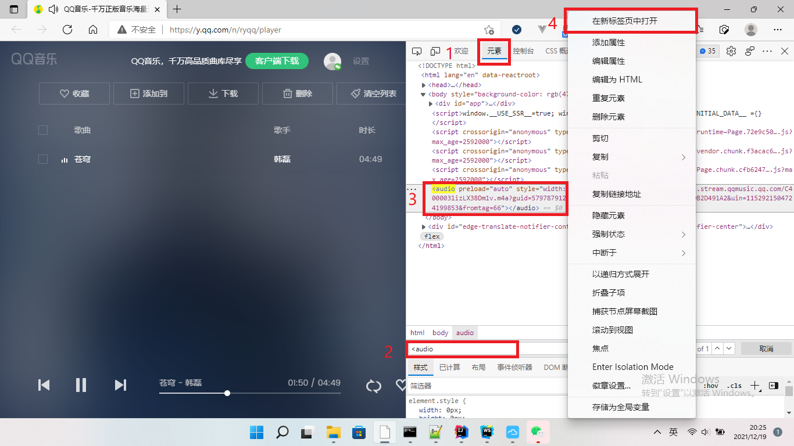
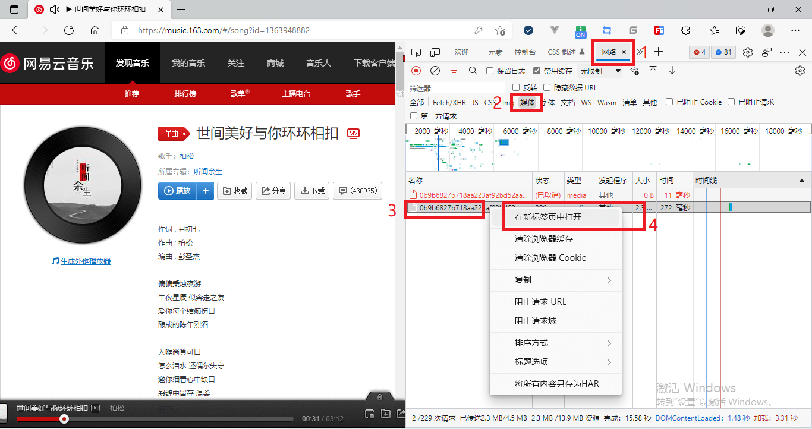

## HTTP 爬取资源

##  爬取音频 (QQ音乐)

打开一首歌曲的播放页面
比如 [苍穹-韩磊](https://y.qq.com/n/ryqq/songDetail/003lizLX38Dm1v),点击播放,进入播放页面后
按 F12 进入控制台
在Element(元素)面板搜索<audio,搜索到音频文件的标签,在url处右键点击在新标签页打开,即可进行下载

## 爬取音频 (网易云音乐)

打开一首歌曲的播放页面
比如 [世间美好与你环环相扣-柏松](https://music.163.com/#/song?id=1363948882)
按 F12 进入控制台,然后 F5 刷新,点击播放
在Network(网络)面板过滤Media(媒体)类型的请求,搜索到音频文件的标签,在url处右键点击在新标签页打开,即可进行下载

