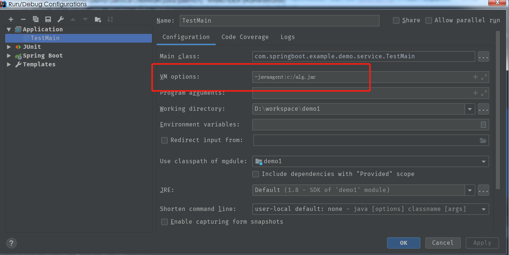
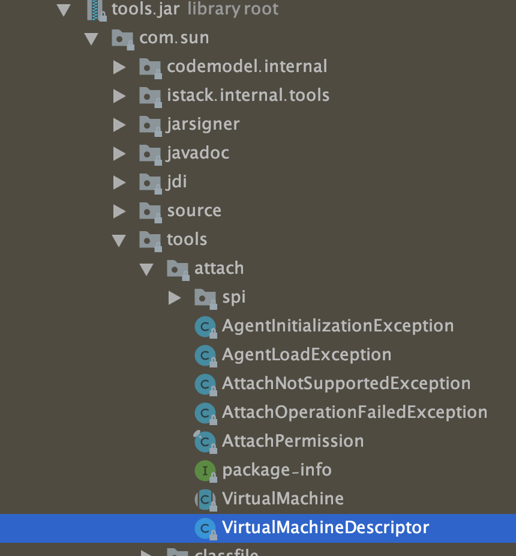
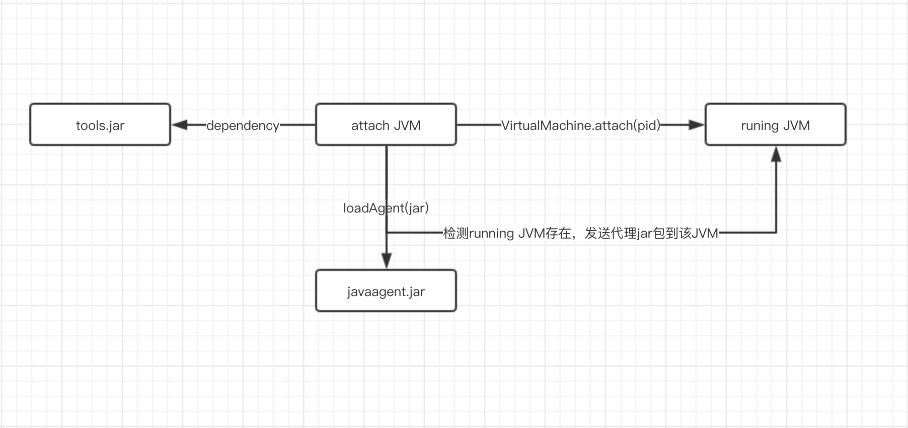
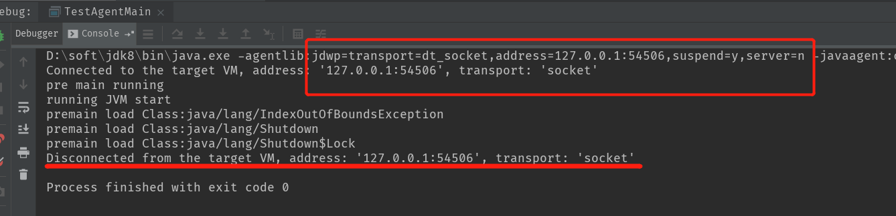

[Java Agent 使用指南]: [javaagent使用指南](https://www.cnblogs.com/rickiyang/p/11368932.html)

# Java Agent 使用指南

今天打算写一下 Java Agent，一开始我对它的概念也比较陌生，后来在别人口中听到 `字节码插桩`、`bTrace`、`Arthas`后面才逐渐了解到Java还提供了这么个工具。

## JVM启动前静态Instrument

Java Agent 是什么？

Java Agent是java命令的一个参数。参数 `-javaagent` 可以用于指定一个 jar 包，并且对该 java 包有2个要求：

1. 这个 jar 包的 MANIFEST.MF 文件必须指定 Premain-Class 项。
2. Premain-Class 指定的那个类必须实现 premain() 方法。

premain 方法，从字面上理解，就是运行在 main 函数之前的的类。当 Java 虚拟机启动时，在执行 main 函数之前，JVM 会先运行`-javaagent`所指定 jar 包内 Premain-Class 这个类的 premain 方法 。

在命令行输入 `java`可以看到相应的参数，其中有 和 java agent相关的：

```bash
-agentlib:<libname>[=<选项>] 
    加载本机代理库 <libname>, 例如 -agentlib:hprof
	另请参阅 -agentlib:jdwp=help 和 -agentlib:hprof=help
-agentpath:<pathname>[=<选项>]
	按完整路径名加载本机代理库
-javaagent:<jarpath>[=<选项>]
	加载 Java 编程语言代理, 请参阅 java.lang.instrument
```

在上面`-javaagent`参数中提到了参阅`java.lang.instrument`，这是在`rt.jar` 中定义的一个包，该路径下有两个重要的类：


该包提供了一些工具帮助开发人员在 Java 程序运行时，动态修改系统中的 Class 类型。其中，使用该软件包的一个关键组件就是 Java Agent。从名字上看，似乎是个 Java 代理之类的，而实际上，他的功能更像是一个 Class 类型的转换器，他可以在运行时接受重新外部请求，对 Class 类型进行修改。

从本质上讲，Java Agent 是一个遵循一组严格约定的常规 Java 类。 上面说到 `-javaagent` 命令要求指定的类中必须要有premain()方法，并且对premain方法的签名也有要求，签名必须满足以下两种格式：

```java
public static void premain(String agentArgs, Instrumentation inst)
    
public static void premain(String agentArgs)
```

JVM 会优先加载 带 `Instrumentation` 签名的方法，加载成功忽略第二种，如果第一种没有，则加载第二种方法。这个逻辑在sun.instrument.InstrumentationImpl 类中：


Instrumentation 类定义如下：

```java
public interface Instrumentation {
    
    //增加一个Class 文件的转换器，转换器用于改变 Class 二进制流的数据，参数 canRetransform 设置是否允许重新转换。
    void addTransformer(ClassFileTransformer transformer, boolean canRetransform);

    //在类加载之前，重新定义 Class 文件，ClassDefinition 表示对一个类新的定义，如果在类加载之后，需要使用 retransformClasses 方法重新定义。addTransformer方法配置之后，后续的类加载都会被Transformer拦截。对于已经加载过的类，可以执行retransformClasses来重新触发这个Transformer的拦截。类加载的字节码被修改后，除非再次被retransform，否则不会恢复。
    void addTransformer(ClassFileTransformer transformer);

    //删除一个类转换器
    boolean removeTransformer(ClassFileTransformer transformer);

    boolean isRetransformClassesSupported();

    //在类加载之后，重新定义 Class。这个很重要，该方法是1.6 之后加入的，事实上，该方法是 update 了一个类。
    void retransformClasses(Class<?>... classes) throws UnmodifiableClassException;

    //是否支持重新定义类
    boolean isRedefineClassesSupported();

    //重新定义类
    void redefineClasses(ClassDefinition... definitions) throws ClassNotFoundException, UnmodifiableClassException;
    
    //theClass是否已被修改
    boolean isModifiableClass(Class<?> theClass);

    //获取当前JVM已加载的所有类
    @SuppressWarnings("rawtypes")
    Class[] getAllLoadedClasses();

    //获取当前JVM已初始化的所有类
    @SuppressWarnings("rawtypes")
    Class[] getInitiatedClasses(ClassLoader loader);

    //获取一个对象的大小
    long getObjectSize(Object objectToSize);

    //将jarfile添加至系统类加载器
    void appendToBootstrapClassLoaderSearch(JarFile jarfile);

    //将jarfile添加至系统类加载器(AppClassLoader)
    void appendToSystemClassLoaderSearch(JarFile jarfile);

    //是否支持修改本地方法前缀
    boolean isNativeMethodPrefixSupported();

    //设置修改本地方法前缀
    void setNativeMethodPrefix(ClassFileTransformer transformer, String prefix);
}
```

最为重要的是上面注释的几个方法，下面我们会用到。

如何使用javaagent？

使用 javaagent 需要几个步骤：

1. 定义一个 MANIFEST.MF 文件，必须包含 Premain-Class 选项，通常也会加入Can-Redefine-Classes 和 Can-Retransform-Classes 选项。
2. 创建一个Premain-Class 指定的类，类中包含 premain 方法，方法逻辑由用户自己确定。
3. 将 premain 的类和 MANIFEST.MF 文件打成 jar 包。
4. 使用参数 -javaagent: jar包路径 启动要代理的方法。

在执行以上步骤后，JVM 会先执行 premain 方法，大部分类加载都会通过该方法，注意：是大部分，不是所有。当然，遗漏的主要是系统类，因为很多系统类先于 agent 执行，而用户类的加载肯定是会被拦截的。也就是说，这个方法是在 main 方法启动前拦截大部分类的加载活动，既然可以拦截类的加载，那么就可以去做重写类这样的操作，结合第三方的字节码编译工具，比如ASM，javassist，cglib等等来改写实现类。

通过上面的步骤我们用代码实现来实现。实现 javaagent 你需要搭建两个工程，一个工程是用来承载 javaagent类，单独的打成jar包；一个工程是javaagent需要去代理的类。即javaagent会在这个工程中的main方法启动之前去做一些事情。

1.首先来实现javaagent工程。

第一步是需要创建一个类，包含premain 方法：

```java
import java.lang.instrument.ClassFileTransformer;
import java.lang.instrument.IllegalClassFormatException;
import java.lang.instrument.Instrumentation;
import java.security.ProtectionDomain;

/**
 * @author: lzpeng
 * @date: 2021/12/12
 * @description:
 */
public class PreMainTraceAgent {

    public static void premain(String agentArgs, Instrumentation inst) {
        System.out.println("agentArgs : " + agentArgs);
        inst.addTransformer(new DefineTransformer(), true);
    }

    static class DefineTransformer implements ClassFileTransformer{

        @Override
        public byte[] transform(ClassLoader loader, String className, Class<?> classBeingRedefined, ProtectionDomain protectionDomain, byte[] classfileBuffer) throws IllegalClassFormatException {
            System.out.println("premain load Class:" + className);
            return classfileBuffer;
        }
    }
}
```

上面就是我实现的一个类，实现了带Instrumentation参数的premain()方法。调用addTransformer()方法对启动时所有的类进行拦截。

然后在 resources 目录下新建目录：META-INF，在该目录下新建文件：MANIFEST.MF：

```txt
CopyManifest-Version: 1.0
Can-Redefine-Classes: true
Can-Retransform-Classes: true
Premain-Class: PreMainTraceAgent

```

注意到第5行有空行。

说一下MANIFEST.MF文件的作用，它还有别的参数允许你做更多的事情，可以用上的有：

> Premain-Class ：包含 premain 方法的类（类的全路径名）
>
> Agent-Class ：包含 agentmain 方法的类（类的全路径名）
>
> Boot-Class-Path ：设置引导类加载器搜索的路径列表。查找类的特定于平台的机制失败后，引导类加载器会搜索这些路径。按列出的顺序搜索路径。列表中的路径由一个或多个空格分开。路径使用分层 URI 的路径组件语法。如果该路径以斜杠字符（“/”）开头，则为绝对路径，否则为相对路径。相对路径根据代理 JAR 文件的绝对路径解析。忽略格式不正确的路径和不存在的路径。如果代理是在 VM 启动之后某一时刻启动的，则忽略不表示 JAR 文件的路径。（可选）
>
> Can-Redefine-Classes ：true表示能重定义此代理所需的类，默认值为 false（可选）
>
> Can-Retransform-Classes ：true 表示能重转换此代理所需的类，默认值为 false （可选）
>
> Can-Set-Native-Method-Prefix： true表示能设置此代理所需的本机方法前缀，默认值为 false（可选）

即在该文件中主要定义了程序运行相关的配置信息，程序运行前会先检测该文件中的配置项。

一个java程序中`-javaagent`参数的个数是没有限制的，所以可以添加任意多个 javaagent。所有的javaagent会按照你定义的顺序执行，例如：

```bash
java -javaagent:agent1.jar -javaagent:agent2.jar -jar MyProgram.jar
```

程序执行的顺序将会是：

MyAgent1.premain -> MyAgent2.premain -> MyProgram.premain

**说回上面的 javaagent 工程，接下来将该工程打成 jar 包，一定要保证 jar 包内的 MANIFEST.MF 文件是上面编写的 MANIFEST.MF 文件。**


agent代码就写完了，下面再重新开一个工程，你只需要写一个带 main 方法的类即可：

```java
public class TestMain {

    public static void main(String[] args) {
        System.out.println("main start");
        try {
            Thread.sleep(3000);
        } catch (InterruptedException e) {
            e.printStackTrace();
        }
        System.out.println("main end");
    }
}
```

很简单，然后需要做的就是将上面的 代理类 和 这个测试类关联起来。有两种方式：

如果你用的是idea，那么你可以点击菜单： run-debug configuration，然后将你的代理类包 指定在 启动参数中即可：



另一种方式是不用 编译器，采用命令行的方法。与上面大致相同，将 上面的测试类编译成 class文件，然后 运行该类即可：

```bash
#将该类编译成class文件
javac TestMain.java
 #指定agent程序并运行该类
java -javaagent:c:/alg.jar TestMain
```

使用上面两种方式都可以运行,输出结果如下：

```txt
...
...
...
agentArgs : null
premain load Class     :java/util/concurrent/ConcurrentHashMap$ForwardingNode
premain load Class     :sun/nio/cs/ThreadLocalCoders
premain load Class     :sun/nio/cs/ThreadLocalCoders$1
premain load Class     :sun/nio/cs/ThreadLocalCoders$Cache
premain load Class     :sun/nio/cs/ThreadLocalCoders$2
premain load Class     :java/util/jar/Attributes
premain load Class     :java/util/jar/Manifest$FastInputStream
...
...
...
premain load Class     :java/lang/Class$MethodArray
premain load Class     :java/lang/Void
main start
premain load Class     :sun/misc/VMSupport
premain load Class     :java/util/Hashtable$KeySet
premain load Class     :sun/nio/cs/ISO_8859_1$Encoder
premain load Class     :sun/nio/cs/Surrogate$Parser
premain load Class     :sun/nio/cs/Surrogate
...
...
...
premain load Class     :sun/util/locale/provider/LocaleResources$ResourceReference
main end
premain load Class     :java/lang/Shutdown
premain load Class     :java/lang/Shutdown$Lock

Process finished with exit code 0
```

上面的输出结果我们能够发现：

1. 执行main方法之前会加载所有的类，包括系统类和自定义类；
2. 在ClassFileTransformer中会去拦截系统类和自己实现的类对象；
3. 如果你有对某些类对象进行改写，那么在拦截的时候抓住该类使用字节码编译工具即可实现。

下面是使用javassist来动态将某个方法替换掉：

```java
Copypackage com.lzpeng.study;

import javassist.*;

import java.io.IOException;
import java.lang.instrument.ClassFileTransformer;
import java.security.ProtectionDomain;

/**
 * @author lzpeng
 * @date 2021-12-12
 * @Desc
 */
public class MyClassTransformer implements ClassFileTransformer {
    @Override
    public byte[] transform(final ClassLoader loader, final String className, final Class<?> classBeingRedefined,final ProtectionDomain protectionDomain, final byte[] classfileBuffer) {
        // 操作Date类
        if ("java/util/Date".equals(className)) {
            try {
                //从ClassPool获得CtClass对象
                final ClassPool classPool = ClassPool.getDefault();
                final CtClass clazz = classPool.get("java.util.Date");
                CtMethod convertToAbbr = clazz.getDeclaredMethod("convertToAbbr");
                //这里对 java.util.Date.convertToAbbr() 方法进行了改写，在 return之前增加了一个 打印操作
                String methodBody = "{sb.append(Character.toUpperCase(name.charAt(0)));" +
                        "sb.append(name.charAt(1)).append(name.charAt(2));" +
                        "System.out.println(\"sb.toString()\");" +
                        "return sb;}";
                convertToAbbr.setBody(methodBody);
                // 返回字节码，并且detachCtClass对象
                byte[] byteCode = clazz.toBytecode();
                //detach的意思是将内存中曾经被javassist加载过的Date对象移除，如果下次有需要在内存中找不到会重新走javassist加载
                clazz.detach();
                return byteCode;
            } catch (Exception ex) {
                ex.printStackTrace();
            }
        }
        // 如果返回null则字节码不会被修改
        return null;
    }
}
```

## JVM启动后动态Instrument

上面介绍的Instrumentation是在 JDK 1.5 中提供的，开发者只能在main加载之前添加手脚，在 Java SE 6 的 Instrumentation 当中，提供了一个新的代理操作方法：agentmain，可以在 main 函数开始运行之后再运行。

跟`premain`函数一样， 开发者可以编写一个含有`agentmain`函数的 Java 类：

```java
//采用attach机制，被代理的目标程序VM有可能很早之前已经启动，当然其所有类已经被加载完成，这个时候需要借助Instrumentation#retransformClasses(Class<?>... classes)让对应的类可以重新转换，从而激活重新转换的类执行ClassFileTransformer列表中的回调
public static void agentmain (String agentArgs, Instrumentation inst)

public static void agentmain (String agentArgs)
```

同样，agentmain 方法中带Instrumentation参数的方法也比不带优先级更高。开发者必须在 manifest 文件里面设置`Agent-Class`来指定包含 agentmain 函数的类。

在 Java 1.6 以后实现启动后加载的新实现是Attach API。Attach API 很简单，只有 2 个主要的类，都在 `com.sun.tools.attach` 包里面：



1. `VirtualMachine` 字面意义表示一个Java 虚拟机，也就是程序需要监控的目标虚拟机，提供了获取系统信息(比如获取内存dump、线程dump，类信息统计(比如已加载的类以及实例个数等)， loadAgent、attach 和 detach （attach 动作的相反行为，从 JVM 上面解除一个代理）等方法，可以实现的功能可以说非常之强大 。该类允许我们通过给 attach 方法传入一个 jvm 的 pid(进程id)，远程连接到 jvm 上 。 代理类注入操作只是它众多功能中的一个，通过`loadAgent`方法向jvm注册一个代理程序agent，在该agent的代理程序中会得到一个Instrumentation实例，该实例可以 在class加载前改变class的字节码，也可以在class加载后重新加载。在调用Instrumentation实例的方法时，这些方法会使用ClassFileTransformer接口中提供的方法进行处理。
2. `VirtualMachineDescriptor` 则是一个描述虚拟机的容器类，配合 VirtualMachine 类完成各种功能。

attach实现动态注入的原理如下：

通过VirtualMachine类的`attach(pid)`方法，便可以attach到一个运行中的java进程上，之后便可以通过`loadAgent(agentJarPath)`来将agent的jar包注入到对应的进程，然后对应的进程会调用agentmain方法。



既然是两个进程之间通信那肯定的建立起连接，VirtualMachine.attach动作类似TCP创建连接的三次握手，目的就是搭建attach通信的连接。而后面执行的操作，例如vm.loadAgent，其实就是向这个socket写入数据流，接收方target VM会针对不同的传入数据来做不同的处理。

我们来测试一下agentmain的使用：

工程结构和 上面premain的测试一样，编写AgentMainTest，然后使用maven插件打包 生成MANIFEST.MF。

```java
public class AgentMainTraceAgent {

    public static void agentmain(String agentArgs, Instrumentation inst) {
        System.out.println("agentArgs : " + agentArgs);
        inst.addTransformer(new DefineTransformer(), true);
    }

    static class DefineTransformer implements ClassFileTransformer{

        @Override
        public byte[] transform(ClassLoader loader, String className, Class<?> classBeingRedefined, ProtectionDomain protectionDomain, byte[] classfileBuffer) throws IllegalClassFormatException {
            System.out.println("premain load Class:" + className);
            return classfileBuffer;
        }
    }
}
```

将agent打包之后，就是编写测试main方法。上面我们画的图中的步骤是：从一个attach JVM去探测目标JVM，如果目标JVM存在则向它发送agent.jar。我测试写的简单了些，找到当前JVM并加载agent.jar。

```java
import com.sun.tools.attach.*;

import java.util.List;

/**
 * @author lzpeng
 * @date 2021-12-12
 * @Desc
 */
public class TestAgentMain {

    public static void main(String[] args) throws Exception {
        //获取当前系统中所有 运行中的 虚拟机
        System.out.println("running JVM start ");
        List<VirtualMachineDescriptor> list = VirtualMachine.list();
        for (VirtualMachineDescriptor vmd : list) {
            //如果虚拟机的名称为 xxx 则 该虚拟机为目标虚拟机，获取该虚拟机的 pid
            //然后加载 java-agent.jar 发送给该虚拟机
            System.out.println(vmd.displayName());
            if (vmd.displayName().endsWith("TestAgentMain")) {
                VirtualMachine virtualMachine = VirtualMachine.attach(vmd.id());
                virtualMachine.loadAgent("D:/java-agent.jar");
                virtualMachine.detach();
            }
        }
    }

}
```

list()方法会去寻找当前系统中所有运行着的JVM进程，你可以打印`vmd.displayName()`看到当前系统都有哪些JVM进程在运行。因为main函数执行起来的时候进程名为当前类名，所以通过这种方式可以去找到当前的进程id。

注意：在mac上安装了的jdk是能直接找到 VirtualMachine 类的，但是在windows中安装的jdk无法找到，如果你遇到这种情况，请手动将你jdk安装目录下：lib目录中的tools.jar添加进当前工程的构建路径中。

运行main方法的输出为：



可以看到实际上是启动了一个socket进程去传输java-agent.jar。先打印了“running JVM start”表名main方法是先启动了，然后才进入代理类的transform方法。

## Instrumentation原理

`instrument`的底层实现依赖于`JVMTI(JVM Tool Interface)`，它是JVM暴露出来的一些供用户扩展的接口集合，JVMTI是基于事件驱动的，JVM每执行到一定的逻辑就会调用一些事件的回调接口（如果有的话），这些接口可以供开发者去扩展自己的逻辑。`JVMTIAgent`是一个利用`JVMTI`暴露出来的接口提供了代理启动时加载(agent on load)、代理通过attach形式加载(agent on attach)和代理卸载(agent on unload)功能的动态库。而`instrument agent`可以理解为一类`JVMTIAgent`动态库，别名是`JPLISAgent(Java Programming Language Instrumentation Services Agent)`，也就是**专门为java语言编写的插桩服务提供支持的代理**。

### 启动时加载instrument agent过程：

1. 创建并初始化 JPLISAgent；
2. 监听 `VMInit` 事件，在 JVM 初始化完成之后做下面的事情：
   1. 创建 InstrumentationImpl 对象 ；
   2. 监听 ClassFileLoadHook 事件 ；
   3. 调用 InstrumentationImpl 的`loadClassAndCallPremain`方法，在这个方法里会去调用 javaagent 中 MANIFEST.MF 里指定的Premain-Class 类的 premain 方法 ；
3. 解析 javaagent 中 MANIFEST.MF 文件的参数，并根据这些参数来设置 JPLISAgent 里的一些内容。

### 运行时加载instrument agent过程：

通过 JVM 的attach机制来请求目标 JVM 加载对应的agent，过程大致如下：

1. 创建并初始化JPLISAgent；
2. 解析 javaagent 里 MANIFEST.MF 里的参数；
3. 创建 InstrumentationImpl 对象；
4. 监听 ClassFileLoadHook 事件；
5. 调用 InstrumentationImpl 的`loadClassAndCallAgentmain`方法，在这个方法里会去调用javaagent里 MANIFEST.MF 里指定的`Agent-Class`类的`agentmain`方法。

### Instrumentation的局限性

大多数情况下，我们使用Instrumentation都是使用其字节码插桩的功能，或者笼统说就是类重定义(Class Redefine)的功能，但是有以下的局限性：

1. premain和agentmain两种方式修改字节码的时机都是类文件加载之后，也就是说必须要带有Class类型的参数，不能通过字节码文件和自定义的类名重新定义一个本来不存在的类。
2. 类的字节码修改称为类转换(Class Transform)，类转换其实最终都回归到类重定义Instrumentation#redefineClasses()方法，此方法有以下限制：
   1. 新类和老类的父类必须相同；
   2. 新类和老类实现的接口数也要相同，并且是相同的接口；
   3. 新类和老类访问符必须一致。 新类和老类字段数和字段名要一致；
   4. 新类和老类新增或删除的方法必须是private static/final修饰的；
   5. 可以修改方法体。

除了上面的方式，如果想要重新定义一个类，可以考虑基于类加载器隔离的方式：创建一个新的自定义类加载器去通过新的字节码去定义一个全新的类，不过也存在只能通过反射调用该全新类的局限性。
