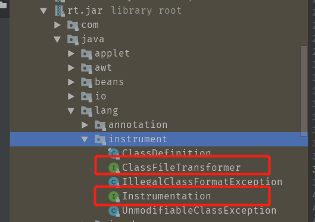
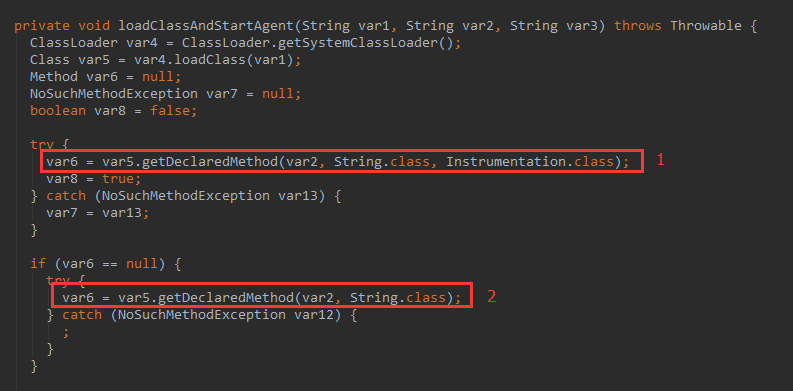
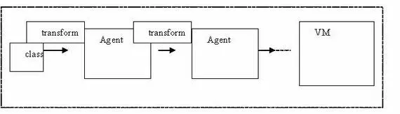
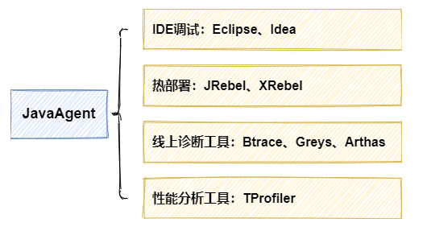

[Java Agent 使用指南]: (https://www.cnblogs.com/rickiyang/p/11368932.html)

[基于Java Instrument的Agent实现]: (https://www.jianshu.com/p/b72f66da679f)

## 介绍

使用 Instrumentation，**使得开发者可以构建一个独立于应用程序的代理程序（Agent），用来监测和协助运行在 JVM 上的程序，甚至能够替换和修改某些类的定义**。有了这样的功能，开发者就可以实现更为灵活的运行时虚拟机监控和 Java 类操作了，这样的特性实际上提供了 **一种虚拟机级别支持的 AOP 实现方式**，使得开发者无需对 JDK 做任何升级和改动，就可以实现某些 AOP 的功能了。

利用 java.lang.instrument 做静态 Instrumentation 是 Java SE 5 的新特性，**它把 Java 的 instrument 功能从本地代码中解放出来，使之可以用 Java 代码的方式解决问题**。

在 Java SE 6 里面，instrumentation 包被赋予了更强大的功能：**启动后的 instrument、本地代码（native code）instrument，以及动态改变 classpath** 等等。这些改变，意味着 **Java 具有了更强的动态控制、解释能力，它使得 Java 语言变得更加灵活多变**。

> 1. **在 Java SE6 里面，最大的改变使运行时的 Instrumentation 成为可能**。在 Java SE 5 中，**Instrument 要求在运行前利用命令行参数或者系统参数来设置代理类**，在实际的运行之中，**虚拟机在初始化之时（在绝大多数的 Java 类库被载入之前），instrumentation 的设置已经启动，并在虚拟机中设置了回调函数，检测特定类的加载情况，并完成实际工作。但是在实际的很多的情况下，我们没有办法在虚拟机启动之时就为其设定代理，这样实际上限制了 instrument 的应用**。而 Java SE 6 的新特性改变了这种情况，**通过 Java Tool API 中的 attach 方式**，我们可以很方便地 **在运行过程中动态地设置加载代理类，以达到 instrumentation 的目的**。
> 2. 另外，对 native 的 Instrumentation 也是 Java SE 6 的一个崭新的功能，这使以前无法完成的功能 —— **对 native 接口的 instrumentation 可以在 Java SE 6 中，通过一个或者一系列的 prefix 添加而得以完成**。
> 3. 最后，**Java SE 6 里的 Instrumentation 也增加了动态添加 class path的功能**。所有这些新的功能，都使得 instrument 包的功能更加丰富，从而使 Java 语言本身更加强大。

## 基本功能和用法

事实上，java.lang.instrument 包的实现，是基于JVMTI机制的：**在 Instrumentation 的实现当中，存在一个 JVMTI 的代理程序，通过调用 JVMTI 当中 Java 类相关的函数来完成Java 类的动态操作**。除开 Instrumentation 功能外，**JVMTI 还在虚拟机内存管理，线程控制，方法和变量操作等方面提供了大量有价值的函数**。

> JVMTI（Java Virtual Machine Tool Interface）是一套由 Java 虚拟机提供的，为 JVM 相关的工具提供的本地编程接口集合。JVMTI 是从 Java SE 5 开始引入，整合和取代了以前使用的 Java Virtual Machine Profiler Interface (JVMPI) 和 the Java Virtual Machine Debug Interface (JVMDI)，而在 Java SE 6 中，JVMPI 和 JVMDI 已经消失了。**JVMTI 提供了一套”代理”程序机制，可以支持第三方工具程序以代理的方式连接和访问 JVM，并利用 JVMTI 提供的丰富的编程接口，完成很多跟 JVM 相关的功能**。

## Instrument两个核心API



1. **ClassFileTransformer**：**定义了类加载前的预处理类**，可以在这个类中对要加载的类的字节码做一些处理，譬如进行字节码增强；

2. **Instrumentation**：增强器，由JVM在入口参数中传递给我们，提供了如下的功能：

   ```java
   public interface Instrumentation {
       
       //增加一个Class 文件的转换器，转换器用于改变 Class 二进制流的数据，参数 canRetransform 设置是否允许重新转换。
       void addTransformer(ClassFileTransformer transformer, boolean canRetransform);
   
       //在类加载之前，重新定义 Class 文件，ClassDefinition 表示对一个类新的定义，如果在类加载之后，需要使用 retransformClasses 方法重新定义。addTransformer方法配置之后，后续的类加载都会被Transformer拦截。对于已经加载过的类，可以执行retransformClasses来重新触发这个Transformer的拦截。类加载的字节码被修改后，除非再次被retransform，否则不会恢复。
       void addTransformer(ClassFileTransformer transformer);
   
       //删除一个类转换器
       boolean removeTransformer(ClassFileTransformer transformer);
   
       //是否支持重新转换类
       boolean isRetransformClassesSupported();
   
       //在类加载之后，重新定义 Class。这个很重要，该方法是1.6 之后加入的，事实上，该方法是 update 了一个类。
       void retransformClasses(Class<?>... classes) throws UnmodifiableClassException;
   
       //是否支持重新定义类
       boolean isRedefineClassesSupported();
   
       //重新定义类
       void redefineClasses(ClassDefinition... definitions) throws ClassNotFoundException, UnmodifiableClassException;
       
       //theClass是否已被修改
       boolean isModifiableClass(Class<?> theClass);
   
       //获取当前JVM已加载的所有类
       @SuppressWarnings("rawtypes")
       Class[] getAllLoadedClasses();
   
       //获取当前JVM已初始化的所有类
       @SuppressWarnings("rawtypes")
       Class[] getInitiatedClasses(ClassLoader loader);
   
       //获取一个对象的大小
       long getObjectSize(Object objectToSize);
   
       //将jarfile添加至系统类加载器
       void appendToBootstrapClassLoaderSearch(JarFile jarfile);
   
       //将jarfile添加至系统类加载器
       void appendToSystemClassLoaderSearch(JarFile jarfile);
   
       //是否支持修改本地方法前缀
       boolean isNativeMethodPrefixSupported();
   
       //设置修改本地方法前缀
       void setNativeMethodPrefix(ClassFileTransformer transformer, String prefix);
   }
   ```

## JVM启动前静态Instrument

**Instrumentation 的最大作用，就是类定义动态改变和操作**。在 Java SE 5 及其后续版本当中，开发者可以在一个普通 Java 程序（带有 main 函数的 Java 类）运行时，**通过 -javaagent参数指定一个特定的 jar 文件（包含 Instrumentation 代理）来启动 Instrumentation 的代理程序**。

1. **编写 premain 函数**

   **编写一个 Java 类，包含如下两个方法当中的任何一个**：

   ```java
   public static void premain(String agentArgs, Instrumentation inst);  [1]
   public static void premain(String agentArgs); [2]
   ```

其中，**[1] 的优先级比 [2] 高，将会被优先执行（[1] 和 [2] 同时存在时，[2] 被忽略）**。在这个 premain 函数中，开发者可以进行对类的各种操作。
这个逻辑在`sun.instrument.InstrumentationImpl`类中：



> 1. **agentArgs 是 premain 函数得到的程序参数**，随同 “-javaagent”一起传入。与 main 函数不同的是，**这个参数是一个字符串而不是一个字符串数组**，如果程序参数有多个，程序将自行解析这个字符串。
> 2. **inst 是一个 java.lang.instrument.Instrumentation 的实例，由 JVM 自动传入**。java.lang.instrument.Instrumentation 是 instrument 包中定义的一个接口，也是这个包的核心部分，**集中了其中几乎所有的功能方法**，例如类定义的转换和操作等等。

2. **jar 文件打包**

   将这个 Java 类打包成一个 jar 文件，**并在其中的META-INF/MAINIFEST.MF属性当中加入” Premain-Class”来指定步骤 1 当中编写的那个带有 premain 的 Java 类**。（可能还需要指定其他属性以开启更多功能）

3. **运行**

   用如下方式运行带有 Instrumentation 的 Java 程序：

   ```bash
   java -javaagent:jar文件的位置 [= 传入 premain 的参数 ]
   ```

**举个替换Java类文件栗子：采用简单的类文件替换的方式来演示 Instrumentation 的使用**

对 Java 类文件的操作，可以理解为对一个 byte 数组的操作（将类文件的二进制字节流读入一个 byte 数组）。**开发者可以在“ClassFileTransformer”的 transform 方法当中得到，操作并最终返回一个类的定义（一个 byte 数组）**。

1. **首先，我们有一个简单的类，TransClass， 可以通过一个静态方法返回一个整数 1**

   ```java
   public class TransClass { 
       public int getNumber() { 
          return 1; 
       } 
   }
   ```

我们运行如下类，可以得到输出 “1”：

   ```java
   public class TestMainInJar { 
     public static void main(String[] args) { 
        System.out.println(new TransClass().getNumber()); 
     } 
   }
   ```

2. **然后，我们将 TransClass 的 getNumber 方法改成如下：**

   ```java
   public int getNumber() { 
       return 2; 
   }
   ```

再将这个返回 2 的 Java 文件编译成类文件，为了区别开原有的返回 1 的类，**我们将返回 2 的这个类文件命名为 TransClass2.class.2**。

3. **接下来，我们建立一个 Transformer 类：这个类实现了 ClassFileTransformer 接口**

   ```java
   import java.io.File; 
   import java.io.FileInputStream; 
   import java.io.IOException; 
   import java.io.InputStream; 
   import java.lang.instrument.ClassFileTransformer; 
   import java.lang.instrument.IllegalClassFormatException; 
   import java.security.ProtectionDomain; 
   
   public class Transformer implements ClassFileTransformer { 
   
       public static final String classNumberReturns2 = "TransClass.class.2"; 
   
       public static byte[] getBytesFromFile(String fileName) { 
           try { 
               // precondition 
               File file = new File(fileName); 
               InputStream is = new FileInputStream(file); 
               long length = file.length(); 
               byte[] bytes = new byte[(int) length]; 
   
               // Read in the bytes 
               int offset = 0; 
               int numRead = 0; 
               while (offset <bytes.length 
                    && (numRead = is.read(bytes, offset, bytes.length - offset)) >= 0) { 
                   offset += numRead; 
               } 
   
               if (offset < bytes.length) { 
                   throw new IOException("Could not completely read file "
                        + file.getName()); 
               } 
               is.close(); 
               return bytes; 
           } catch (Exception e) { 
               System.out.println("error occurs in _ClassTransformer!"
                    + e.getClass().getName()); 
               return null; 
           } 
       } 
      /**
       * 参数： 
       * loader - 定义要转换的类加载器；如果是引导加载器，则为 null 
       * className - 完全限定类内部形式的类名称和 The Java Virtual Machine Specification 中定义的接口名称。例如，"java/util/List"。 
       * classBeingRedefined - 如果是被重定义或重转换触发，则为重定义或重转换的类；如果是类加载，则为 null 
       * protectionDomain - 要定义或重定义的类的保护域 
       * classfileBuffer - 类文件格式的输入字节缓冲区（不得修改） 
       * 返回： 
       * 一个格式良好的类文件缓冲区（转换的结果），如果未执行转换,则返回 null。 
       * 抛出： 
       * IllegalClassFormatException - 如果输入不表示一个格式良好的类文件 
       */
       public byte[] transform(ClassLoader l, String className, Class<?> c, 
            ProtectionDomain pd, byte[] b) throws IllegalClassFormatException { 
           if (!className.equals("TransClass")) { 
               return null; 
           } 
           return getBytesFromFile(classNumberReturns2); 
       } 
   }
   ```

**其中，getBytesFromFile 方法根据文件名读入二进制字符流，而 ClassFileTransformer 当中规定的 transform 方法则完成了类定义的替换转换**。

4. **最后，我们建立一个 Premain 类，写入 Instrumentation 的代理方法 premain：**

   ```java
   public class Premain { 
       public static void premain(String agentArgs， Instrumentation inst)  throws ClassNotFoundException， UnmodifiableClassException { 
           inst.addTransformer(new Transformer()); 
       } 
   }
   ```

可以看出，addTransformer 方法并没有指明要转换哪个类。**转换发生在 premain 函数执行之后，main 函数执行之前，这时每装载一个类，transform 方法就会执行一次，看看是否需要转换**，所以，在 transform（Transformer 类中）方法中，程序用 className.equals("TransClass") 来判断当前的类是否需要转换。

5. **代码完成后，我们将他们打包为 TestInstrument1.jar。返回 1 的那个 TransClass 的类文件保留在 jar 包中，而返回 2 的那个 TransClass.class.2 则放到 jar 的外面。在 manifest 里面加入如下属性来指定 premain 所在的类：**

   ```txt
   Manifest-Version: 1.0 
   Premain-Class: Premain
   ```

6. **在运行这个程序的时候，如果我们用普通方式运行这个 jar 中的 main 函数，可以得到输出“1”。如果用下列方式运行：**

   ```bash
   java -javaagent:TestInstrument1.jar -cp TestInstrument1.jar TestMainInJar
   ```

则会得到输出“2”。

当然，**程序运行的 main 函数不一定要放在 premain 所在的这个 jar 文件里面**，这里只是为了例子程序打包的方便而放在一起的。 **除开用 addTransformer 的方式，Instrumentation 当中还有另外一个方法“redefineClasses”来实现 premain 当中指定的转换**。用法类似，如下：

   ```java
   public class Premain { 
       public static void premain(String agentArgs， Instrumentation inst)  throws ClassNotFoundException， UnmodifiableClassException { 
           ClassDefinition def = new ClassDefinition(TransClass.class， Transformer.getBytesFromFile(Transformer.classNumberReturns2)); 
           inst.redefineClasses(new ClassDefinition[] { def }); 
           System.out.println("success"); 
       } 
   }
   ```

**redefineClasses 的功能比较强大，可以批量转换很多类。**



多个代理可以同时执行，按照代理指定的顺序被依次调用

## JVM启动后动态Instrument

在 Java SE 5 当中，开发者只能在 premain 当中施展想象力，**所作的 Instrumentation 也仅限与 main 函数执行前，这样的方式存在一定的局限性**。

在 Java SE 5 的基础上，Java SE 6 针对这种状况做出了改进，**开发者可以在 main 函数开始执行以后，再启动自己的 Instrumentation 程序**。

在 Java SE 6 的 Instrumentation 当中，**有一个跟 premain“并驾齐驱”的“agentmain”方法，可以在 main 函数开始运行之后再运行**。跟 premain 函数一样， 开发者可以编写一个含有“agentmain”函数的 Java 类：

```java
public static void agentmain (String agentArgs, Instrumentation inst); [1] 
public static void agentmain (String agentArgs);[2]
```

同样，**[1] 的优先级比 [2] 高，将会被优先执行（[1] 和 [2] 同时存在时，[2] 被忽略）**。跟 premain 函数一样，开发者可以在 agentmain 中进行对类的各种操作。其中的 agentArgs 和 Inst 的用法跟 premain 相同。

> 与“Premain-Class”类似，开发者必须在 manifest 文件里面设置“Agent-Class”来指定包含 agentmain 函数的类。

可是，跟 premain 不同的是，agentmain 需要在 main 函数开始运行后才启动，**这样的时机应该如何确定呢，这样的功能又如何实现呢？**

在 Java SE 6 文档当中，开发者也许无法在 java.lang.instrument 包相关的文档部分看到明确的介绍，更加无法看到具体的应用 agnetmain 的例子。不过，在 Java SE 6 的新特性里面，有一个不太起眼的地方，揭示了 agentmain 的用法。**这就是 Java SE 6 当中提供的 Attach API**。

Attach API 不是 Java 的标准 API，而是 Sun 公司提供的一套扩展 API，**用来向目标 JVM ”附着”（Attach）代理工具程序的**。有了它，**开发者可以方便的监控一个 JVM，运行一个外加的代理程序**。

Attach API 很简单，只有 2 个主要的类，都在 com.sun.tools.attach 包里面：

> 1. **VirtualMachine 代表一个 Java 虚拟机**，也就是程序需要监控的目标虚拟机，提供了 JVM 枚举，**Attach 动作和 Detach 动作（Attach 动作的相反行为，从 JVM 上面解除一个代理）等等** ;
>
>    VirtualMachine类，该类允许我们 **通过给attach方法传入一个jvm的pid（进程id），远程连接到jvm上** 。然后我们可以 **通过loadAgent方法向jvm注册一个代理程序agent，在该agent的代理程序中会得到一个Instrumentation实例**，该实例可以 **在class加载前改变class的字节码，也可以在class加载后重新加载**。在调用Instrumentation实例的方法时，这些方法会使用ClassFileTransformer接口中提供的方法进行处理。
>
> 2. **VirtualMachineDescriptor 则是一个描述虚拟机的容器类**，配合 VirtualMachine 类完成各种功能。

**为了简单起见，我们举例简化如下**：依然用类文件替换的方式

> 1. 将一个返回 1 的函数替换成返回 2 的函数，Attach API 写在一个线程里面，用睡眠等待的方式，**每隔半秒时间检查一次所有的 Java 虚拟机**，当发现有新的虚拟机出现的时候，**就调用 attach 函数，随后再按照 Attach API 文档里面所说的方式装载 Jar 文件**。等到 5 秒钟的时候，attach 程序自动结束。
> 2. 在 main 函数里面，程序每隔半秒钟输出一次返回值（显示出返回值从 1 变成 2）。

**TransClass 类和 Transformer 类的代码不变，参看上一节介绍。 含有 main 函数的 TestMainInJar 代码为：**

```java
// 程序每隔半秒钟输出一次返回值（显示出返回值从 1 变成 2）
public class TestMainInJar { 
    public static void main(String[] args) throws InterruptedException { 
        System.out.println(new TransClass().getNumber()); 
        int count = 0; 
        while (true) { 
            Thread.sleep(500); 
            count++; 
            int number = new TransClass().getNumber(); 
            System.out.println(number); 
            if (3 == number || count >= 10) { 
                break; 
            } 
        } 
    } 
}
```

**含有 agentmain 的 AgentMain 类的代码为：**

```java
import java.lang.instrument.ClassDefinition; 
import java.lang.instrument.Instrumentation; 
import java.lang.instrument.UnmodifiableClassException; 

public class AgentMain { 
    public static void agentmain(String agentArgs, Instrumentation inst)  throws ClassNotFoundException, UnmodifiableClassException, InterruptedException { 
        inst.addTransformer(new Transformer (), true); 
        inst.retransformClasses(TransClass.class); 
        System.out.println("Agent Main Done"); 
    } 
}
```

其中，**retransformClasses 是 Java SE 6 里面的新方法，它跟 redefineClasses 一样，可以批量转换类定义，多用于 agentmain 场合**。

Jar 文件跟 Premain 那个例子里面的 Jar 文件差不多，也是把 main 和 agentmain 的类，TransClass，Transformer 等类放在一起，打包为“TestInstrument1.jar”，而 Jar 文件当中的 Manifest 文件为 :

```txt
Manifest-Version: 1.0 
Agent-Class: AgentMain
```

另外，为了运行 Attach API，我们可以再写一个控制程序来模拟监控过程：

```java
import com.sun.tools.attach.VirtualMachine; 
import com.sun.tools.attach.VirtualMachineDescriptor; 

// 一个运行 Attach API 的线程子类
// 每隔半秒时间检查一次所有的 Java 虚拟机
static class AttachThread extends Thread { 
        
        private final List<VirtualMachineDescriptor> listBefore; 

        private final String jar; 

        AttachThread(String attachJar, List<VirtualMachineDescriptor> vms) { 
            listBefore = vms;  // 记录程序启动时的 VM 集合
            jar = attachJar; 
        } 

        public void run() { 
            VirtualMachine vm = null; 
            List<VirtualMachineDescriptor> listAfter = null; 
            try { 
                int count = 0; 
                while (true) { 
                    listAfter = VirtualMachine.list(); 
                    for (VirtualMachineDescriptor vmd : listAfter) { 
                        if (!listBefore.contains(vmd)) { 
                            // 如果 VM 有增加，我们就认为是被监控的 VM 启动了
                            // 这时，我们开始监控这个 VM 
                            vm = VirtualMachine.attach(vmd); 
                            break; 
                        } 
                    } 
                    Thread.sleep(500); 
                    count++; 
                    if (null != vm || count >= 10) { 
                        break; 
                    } 
                } 
                vm.loadAgent(jar); 
                vm.detach(); 
            } catch (Exception e) { 
                 // ignore 
            } 
        } 
    } 

public static void main(String[] args) throws InterruptedException {     
     new AttachThread("TestInstrument1.jar", VirtualMachine.list()).start(); 
}
```

运行时，**首先运行上面这个启动新线程的 main 函数**，然后，在 5 秒钟内（仅仅简单模拟 JVM 的监控过程）运行如下命令启动测试 Jar 文件 :

```bash
java –cp TestInstrument1.jar TestMainInJar
```

如果时间掌握得不太差的话，程序首先会在屏幕上打出 1，这是改动前的类的输出，然后会打出一些 2，**这个表示 agentmain 已经被 Attach API 成功附着到 JVM 上，代理程序生效了**，当然，还可以看到“Agent Main Done”字样的输出。

## 本地方法Instrument

在 JDK 1.5 版本的 Instrumentation 里，并没有对Java本地方法（Native Method）的处理方式，而且在 Java 标准的 JVMTI 之下，并没有办法改变 method signature， 这就使替换本地方法非常地困难。**一个比较直接而简单的想法是，在启动时替换本地代码所在的动态链接库**—— 但是这样，**本质上是一种静态的替换，而不是动态的 Instrumentation**。

而且，这样可能需要编译较大数量的动态链接库 —— 比如，我们有三个本地函数，假设每一个都需要一个替换，而在不同的应用之下，可能需要不同的组合，那么如果我们把三个函数都编译在同一个动态链接库之中，最多我们需要 8 个不同的动态链接库来满足需要。当然，我们也可以独立地编译之，那样也需要 6 个动态链接库——无论如何，这种繁琐的方式是不可接受的。

在 Java SE 6 中，新的 Native Instrumentation 提出了一个新的 native code 的解析方式，作为原有的 native method 的解析方式的一个补充，来很好地解决了一些问。这就是在新版本的 java.lang.instrument 包里，**我们拥有了对 native 代码的 instrument 方式 —— 设置 prefix**。

假设我们有了一个 native 函数，名字叫 nativeMethod，**在运行过程中，我们需要将它指向另外一个函数（需要注意的是，在当前标准的 JVMTI 之下，除了 native 函数名，其他的 signature 需要一致）**。比如我们的 Java 代码是：


```java
package nativeTester; 
class nativePrefixTester{ 
     native int nativeMethod(int input); 
}
```

那么我们已经实现的本地代码是 :

```java
jint Java_nativeTester_nativeMethod(jclass thiz, jobject thisObj, jint input);
```

现在我们需要在调用这个函数时，使之指向另外一个函数。那么按照 J2SE 的做法，**我们可以按他的命名方式，加上一个 prefix 作为新的函数名。比如，我们以 "another_" 作为 prefix**，那么我们新的函数是 :

```java
jint Java_nativeTester_another_nativeMethod(jclass thiz, jobject thisObj, jint input);
```

然后将之编入动态链接库之中。 **现在我们已经有了新的本地函数，接下来就是做 instrument 的设置**。正如以上所说的，**我们可以使用 premain 方式，在虚拟机启动之时就载入 premain 完成 instrument 代理设置。也可以使用 agentmain 方式，去 attach 虚拟机来启动代理**。而设置 native 函数的也是相当简单的 :

```java
premain(){  // 或者也可以在 agentmain 里
    if (!isNativeMethodPrefixSupported()){ 
        return; // 如果无法设置，则返回
    setNativeMethodPrefix(transformer,"another_"); // 设置 native 函数的 prefix，注意这个下划线必须由用户自己规定
    …
}
```

在这里要注意两个问题：

1. **不是在任何的情况下都是可以设置 native 函数的 prefix 的；首先，我们要注意到 agent 包之中的 Manifest 所设定的特性 :**

   ```txt
   Can-Set-Native-Method-Prefix: true
   ```

要注意，**这一个参数都可以影响是否可以设置 native prefix**，而且，在默认的设置之中，这个参数是 false 的，我们需要将之设置成 true（顺便说一句，对 Manifest 之中的属性来说都是大小写无关的，当然，如果给一个不是“true”的值，就会被当作 false 值处理）。

当然，我们还需要**确认虚拟机本身是否支持 setNativePrefix**。在 Java API 里，**Instrumentation 类提供了一个函数 isNativePrefix，通过这个函数我们可以知道该功能是否可以实行**。

2. **我们可以为每一个 ClassTransformer 加上它自己的 nativeprefix：**

   **每一个 ClassTransformer 都可以为同一个 class 做 transform**，因此对于一个 Class 来说，一个 native 函数可能有不同的 prefix，因此对这个函数来说，它可能也有好几种解析方式。 在 Java SE 6 当中，Native prefix 的解释方式如下：**对于某一个 package 内的一个 class 当中的一个 native method 来说，首先，假设我们对这个函数的 transformer 设置了 native 的 prefix “another”，它将这个函数接口解释成** :

由 Java 的函数接口：

   ```java
   native void method()
   ```

和上述 prefix "another"，去寻找本地代码中的函数：

   ```java
   // 请注意 prefix 在函数名中出现的位置！
   void Java_package_class_another_method(jclass theClass, jobject thiz); 
   ```

一旦可以找到，那么调用这个函数，整个解析过程就结束了；**如果没有找到，那么虚拟机将会做进一步的解析工作。我们将利用 Java native 接口最基本的解析方式 , 去找本地代码中的函数** :

   ```java
   void Java_package_class_method(jclass theClass, jobject thiz);
   ```

如果找到，则执行之。否则，因为没有任何一个合适的解析方式，于是宣告这个过程失败。 那么如果有多个 transformer，同时每一个都有自己的 prefix，又该如何解析呢？**事实上，虚拟机是按 transformer 被加入到的 Instrumentation 之中的次序去解析的（还记得我们最基本的 addTransformer 方法吗？）**。 假设我们有三个 transformer 要被加入进来，他们的次序和相对应的 prefix 分别为：transformer1 和“prefix1_”，transformer2 和 “prefix2_”，transformer3 和 “prefix3_”。那么，虚拟机会首先做的就是将接口解析为 :

   ```java
   native void prefix1_prefix2_prefix3_native_method()
   ```
然后去找它相对应的 native 代码。 但是如果第二个 transformer（transformer2）没有设定 prefix，那么很简单，我们得到的解析是：

   ```java
   native void prefix1_prefix3_native_method()
   ```

这个方式简单而自然。 当然，对于多个 prefix 的情况，我们还要注意一些复杂的情况。比如，假设我们有一个 native 函数接口是：

   ```java
   native void native_method()
   ```

然后我们为它设置了两个 prefix，比如 "wrapped_" 和 "wrapped2_"，那么，我们得到的是什么呢？

   ```java
   // 这个函数名正确吗？
   void Java_package_class_wrapped_wrapped2_method(jclass theClass, jobject thiz); 
   ```

答案是否定的，**因为事实上，对 Java 中 native 函数的接口到 native 中的映射，有一系列的规定，因此可能有一些特殊的字符要被代入**。而实际中，这个函数的正确的函数名是：

   ```java
   // 只有这个函数名会被找到
   void Java_package_class_wrapped_1wrapped2_1method(jclass theClass, jobject thiz);
   ```

很有趣不是吗？因此如果我们要做类似的工作，**一个很好的建议是首先在 Java 中写一个带 prefix 的 native 接口，用 javah 工具生成一个 c 的 header-file，看看它实际解析得到的函数名是什么，这样我们就可以避免一些不必要的麻烦**。

另外一个事实是，与我们的想像不同，**对于两个或者两个以上的 prefix，虚拟机并不做更多的解析；它不会试图去掉某一个 prefix，再来组装函数接口。它做且仅作两次解析**。

总之，**新的 native 的 prefix-instrumentation 的方式，改变了以前 Java 中 native 代码无法动态改变的缺点**。在当前，**利用 JNI 来写 native 代码也是 Java 应用中非常重要的一个环节**，因此它的动态化意味着整个 Java 都可以动态改变了 —— **现在我们的代码可以利用加上 prefix 来动态改变 native 函数的指向**。

正如上面所说的，如果找不到，虚拟机还会去尝试做标准的解析，这让我们拥有了动态地替换 native 代码的方式，我们可以将许多带不同 prefix 的函数编译在一个动态链接库之中，**而通过 instrument 包的功能，让 native 函数和 Java 函数一样动态改变、动态替换**。 当然，现在的 native 的 instrumentation 还有一些限制条件，比如，不同的 transformer 会有自己的 native prefix，就是说，**每一个 transformer 会负责他所替换的所有类而不是特定类的 prefix** —— 因此这个粒度可能不够精确。

## BootClassPath / SystemClassPath 的动态增补

我们知道，通过设置系统参数或者通过虚拟机启动参数，我们可以**设置一个虚拟机运行时的 boot class 加载路径（-Xbootclasspath）和 system class（-cp）加载路径**。当然，我们在运行之后无法替换它。然而，我们也许有时候要需要把某些 jar 加载到 bootclasspath 之中，而我们无法应用上述两个方法；**或者我们需要在虚拟机启动之后来加载某些 jar 进入 bootclasspath**。在 Java SE 6 之中，我们可以做到这一点了。

实现这几点很简单，首先，我们依然需要 **确认虚拟机已经支持这个功能**，然后在 premain/agentmain 之中加上需要的 classpath。**我们可以在premain/agentmain方法中 Instrumentation inst 里使用 appendToBootstrapClassLoaderSearch/appendToSystemClassLoaderSearch来完成这个任务**。

同时我们可以注意到，**在 agent 的 manifest 里加入 Boot-Class-Path 其实一样可以在动态地载入agent自己的 boot class 路径**，当然，在 Java code 中它可以更加动态方便和智能地完成 —— 我们可以很方便地加入判断和选择成分。

**在这里我们也需要注意几点：**

1. 首先，**我们加入到 classpath 的 jar 文件中不应当带有任何和系统的 instrumentation 有关的系统同名类**，不然，一切都陷入不可预料之中 —— 这不是一个工程师想要得到的结果，不是吗？
2. 其次，**我们要注意到虚拟机的 ClassLoader 的工作方式，它会记录解析结果**。比如，我们曾经要求读入某个类 someclass，但是失败了，ClassLoader 会记得这一点。即使我们在后面动态地加入了某一个 jar，含有这个类，ClassLoader 依然会认为我们无法解析这个类，与上次出错的相同的错误会被报告。
3. 再次我们知道在 Java 语言中有一个系统参数`java.class.path`，这个 property 里面记录了我们当前的 classpath，但是，我们使用这两个函数，**虽然真正地改变了实际的 classpath，却不会对这个 property 本身产生任何影响**。

> 在公开的 JavaDoc 中我们可以发现一个很有意思的事情，Sun 的设计师们告诉我们，**这个功能事实上依赖于 ClassLoader 的 appendtoClassPathForInstrumentation 方法 —— 这是一个非公开的函数，因此我们不建议直接（使用反射等方式）使用它，事实上，instrument 包里的这两个函数已经可以很好的解决我们的问题了**。

## META-INF/MAINIFEST.MF清单

**以下是agent jar文件的Manifest Attributes清单：**

> 1. **Premain-Class** 如果 JVM 启动时指定了代理，那么此属性指定代理类，**即包含 premain 方法的类**。如果 JVM 启动时指定了代理，那么此属性是必需的。如果该属性不存在，那么 JVM 将中止。**注：此属性是类名，不是文件名或路径**。
> 2. **Agent-Class** 如果实现支持 VM 启动之后某一时刻启动代理的机制，那么此属性指定代理类，**即包含 agentmain 方法的类**。 此属性是必需的，如果不存在，代理将无法启动。**注：这是类名，而不是文件名或路径**。
> 3. **Boot-Class-Path** 设置引导类加载器搜索的路径列表。路径表示目录或库（在许多平台上通常作为 JAR 或 zip 库被引用）。**查找类的特定于平台的机制失败后，引导类加载器会搜索这些路径**。按列出的顺序搜索路径。列表中的路径由一个或多个空格分开。路径使用分层 URI 的路径组件语法。如果该路径以斜杠字符（“/”）开头，则为绝对路径，否则为相对路径。相对路径根据代理 JAR 文件的绝对路径解析。忽略格式不正确的路径和不存在的路径。如果代理是在 VM 启动之后某一时刻启动的，则忽略不表示 JAR 文件的路径。此属性是可选的。
> 4. **Can-Redefine-Classes** 布尔值（true 或 false，与大小写无关）。**是否能重定义此代理所需的类**。true 以外的值均被视为 false。此属性是可选的，默认值为 false。
> 5. **Can-Retransform-Classes** 布尔值（true 或 false，与大小写无关）。**是否能重转换此代理所需的类**。true 以外的值均被视为 false。此属性是可选的，默认值为 false。
> 6. **Can-Set-Native-Method-Prefix** 布尔值（true 或 false，与大小写无关）。**是否能设置此代理所需的本机方法前缀**。true 以外的值均被视为 false。此属性是可选的，默认值为 false。

## Instrumentation原理

`instrument`的底层实现依赖于`JVMTI(JVM Tool Interface)`，它是JVM暴露出来的一些供用户扩展的接口集合，JVMTI是基于事件驱动的，JVM每执行到一定的逻辑就会调用一些事件的回调接口（如果有的话），这些接口可以供开发者去扩展自己的逻辑。`JVMTIAgent`是一个利用`JVMTI`暴露出来的接口提供了代理启动时加载(agent on load)、代理通过attach形式加载(agent on attach)和代理卸载(agent on unload)功能的动态库。而`instrument agent`可以理解为一类`JVMTIAgent`动态库，别名是`JPLISAgent(Java Programming Language Instrumentation Services Agent)`，也就是**专门为java语言编写的插桩服务提供支持的代理**。

### 启动时加载instrument agent过程：

1. 创建并初始化 JPLISAgent；
2. 监听 `VMInit` 事件，在 JVM 初始化完成之后做下面的事情：
   1. 创建 InstrumentationImpl 对象 ；
   2. 监听 ClassFileLoadHook 事件 ；
   3. 调用 InstrumentationImpl 的`loadClassAndCallPremain`方法，在这个方法里会去调用 javaagent 中 MANIFEST.MF 里指定的Premain-Class 类的 premain 方法 ；
3. 解析 javaagent 中 MANIFEST.MF 文件的参数，并根据这些参数来设置 JPLISAgent 里的一些内容。

### 运行时加载instrument agent过程：

通过 JVM 的attach机制来请求目标 JVM 加载对应的agent，过程大致如下：

1. 创建并初始化JPLISAgent；
2. 解析 javaagent 里 MANIFEST.MF 里的参数；
3. 创建 InstrumentationImpl 对象；
4. 监听 ClassFileLoadHook 事件；
5. 调用 InstrumentationImpl 的`loadClassAndCallAgentmain`方法，在这个方法里会去调用javaagent里 MANIFEST.MF 里指定的`Agent-Class`类的`agentmain`方法。

### Instrumentation的局限性

大多数情况下，我们使用Instrumentation都是使用其字节码插桩的功能，或者笼统说就是类重定义(Class Redefine)的功能，但是有以下的局限性：

1. premain和agentmain两种方式修改字节码的时机都是类文件加载之后，也就是说必须要带有Class类型的参数，不能通过字节码文件和自定义的类名重新定义一个本来不存在的类。
2. 类的字节码修改称为类转换(Class Transform)，类转换其实最终都回归到类重定义Instrumentation#redefineClasses()方法，此方法有以下限制：
   1. 新类和老类的父类必须相同；
   2. 新类和老类实现的接口数也要相同，并且是相同的接口；
   3. 新类和老类访问符必须一致。 新类和老类字段数和字段名要一致；
   4. 新类和老类新增或删除的方法必须是private static/final修饰的；
   5. 可以修改方法体。

除了上面的方式，如果想要重新定义一个类，可以考虑基于类加载器隔离的方式：创建一个新的自定义类加载器去通过新的字节码去定义一个全新的类，不过也存在只能通过反射调用该全新类的局限性。

## Agent 的应用


