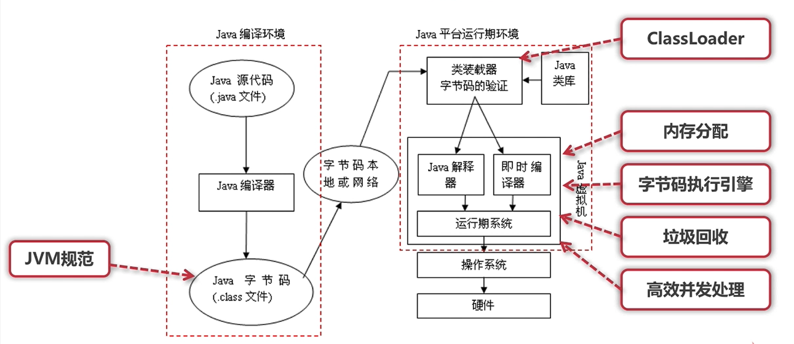
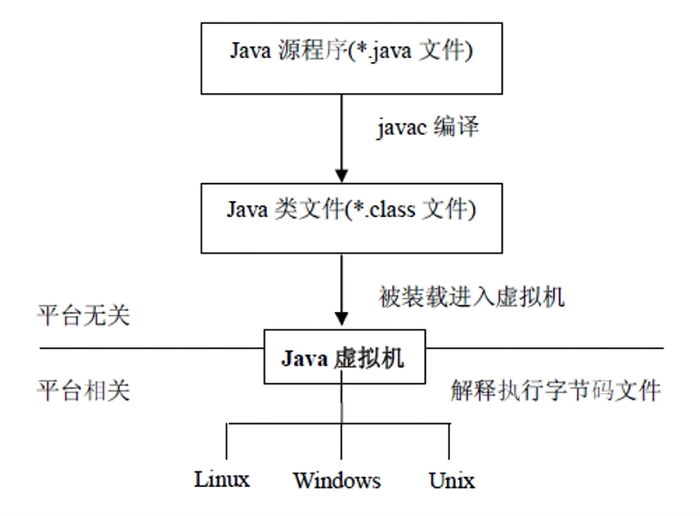
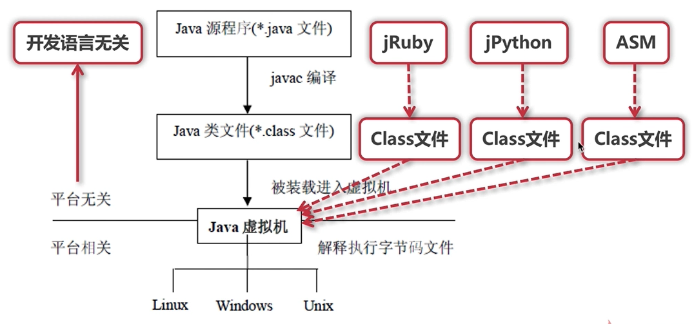

# 理论+实战 构建完整JVM知识体系

##  认识JVM规范

本章首先从三种认知角度带你了解JVM以及JVM的组成，帮你建立JVM知识体系，再通过阅读JVM规范来带大家掌握Class文件的格式，实现Class文件字节码的阅读，之后带大家进入ASM的开发，学会动态创建Java类。

### 2-1 从三种认知角度重识JVM

认识JVM: 是什么、有什么、能干什么

- JVM(Java Virtual Machine), 也就是Java虚拟机;
- 所谓虚拟机是指通过软件模拟的具有完整硬件系统功能的、运行在一个完全隔离环境中的计算机系统;
- JVM 是通过软件来模拟Java字节码的指令集，是Java程序的运行环境

  
JVM 主要功能

- 通过 ClassLoader 寻找和装载 class 文件
- 解释字节码成为指令并执行，提供class文件的运行环境
- 进行运行期间的内存分配和垃圾回收
- 提供与硬件交互的平台

虚拟机是Java平台无关的保障

### 2-2 JVM规范作用及其核心

理解JVM规范的作用
- Java虚拟机规范为不同平台提供了一种Java技术代码的规范
- 该规范使Java软件独立于平台,因为编译是针对作文虚拟机的“一般机器”而做
  
- 这个“一般机器”可用软件模拟并运行于各种现存的计算机系统，也可用硬件来实现

了解JVM规范里面规定的主要内容

- 字节码指令集(相当于中央处理器CPU)
- Class文件的格式
- 数据类型和值
- 运行时数据区
- 栈帧
- 特殊方法
- 类库
- 异常
- 虚拟机的启动、加载、链接、和初始化

[Java SE 下载](https://oracle.com/technetwork/java/javase/downloads/index.html)
[Oracle虚拟机规范官网](https://docs.oracle.com/javase/specs/index.html)

### 2-3 理解JVM规范中的虚拟机结构 
### 2-4 如何学习JVM规范中的指令集 
### 2-5 Class字节码解析：理解ClassFile结构 
### 2-6 阅读Class字节码：常量池 
### 2-7 阅读Class字节码：类定义和属性 
### 2-8 阅读Class字节码：方法和方法调用 
### 2-9 ASM开发：编程模型和核心API 
### 2-10 ASM开发：ClassVisitor开发 
### 2-11 ASM开发：MethodVisitor开发
### 2-12 ASM开发：实现模拟AOP功能 

##  类加载、连接和初始化

  本章将带大家从类加载到JVM再到类卸载，剖析完整过程中的每个步骤的细节功能和核心技能，结合实战，重点需要大家理解类加载、类加载器，双亲委派模型，理解并掌握各种主动使用类的初始化时机等。

    - 3-1 类加载和类加载器 
    - 3-2 案例：类加载器使用 
    - 3-3 双亲委派模型 
    - 3-4 案例：自定义ClassLoader 
    - 3-5 双亲委派模型说明和代码示例 
    - 3-6 类连接和初始化 
    - 3-7 案例：类的主动初始化 
    - 3-8 案例：类的初始化机制和顺序 

##  内存分配

  本章先带大家系统学习Java的内存分配模型，堆内存核心内容，内存分配相关的各种参数的配置和使用，然后带大家掌握各种内存溢出，学习如何使用MAT工具进行内存溢出的分析和问题查找。

    - 4-1 JVM的简化架构和运行时数据区 
    - 4-2 Java堆内存模型和分配 
    - 4-3 案例：Trace跟踪和Java堆的参数配置 
    - 4-4 案例：新生代配置和GC日志格式 
    - 4-5 案例：使用MAT进行内存分析 
    - 4-6 案例：堆、栈、元空间的参数配置 

##  字节码执行引擎

  本章先带大家深入Java栈，理解栈帧、运行期操作数和局部变量表之间的交互关系，再带大家剖析方法调用，掌握静态分派和动态分派，最后通过实战带大家理解如何执行方法中的字节码指令。

    - 5-1 栈帧和局部变量表 
    - 5-2 案例：slot是复用的 
    - 5-3 案例：操作数栈 
    - 5-4 静态分派和动态分派 

##  垃圾回收

  本章先来掌握垃圾回收的不可达算法、垃圾判断步骤、GC类型、引用类型等基础内容，再带大家深入垃圾回收的算法，包括标记清除法、复制算法、标记整理等，最后带大家掌握各种垃圾收集器，包括串行收集器、并行收集器、新生代Parallel Scavenge收集器、CMS、G1等。...

    - 6-1 垃圾回收基础和根搜索算法 
    - 6-2 引用分类 
    - 6-3 案例：各种引用的实现 
    - 6-4 垃圾回收基础【跨代引用、记忆集、写屏障、判断垃圾的步骤、STW】 
    - 6-5 垃圾回收算法 
    - 6-6 垃圾收集器基础和串行收集器 
    - 6-7 并行收集器和Parallel Scavenge收集器 
    - 6-8 CMS收集器 
    - 6-9 G1收集器 
    - 6-10 ZGC收集器、GC性能指标和JVM内存配置原则 

##  高效并发

  本章先来分析Java内存模型，内存间的交互操作，然后学习多线程的可见性、有序性和指令重排、线程安全的处理方法，最后带大家学习自旋锁、锁消除、锁粗化、轻量级锁、偏向锁等锁优化。

    - 7-1 Java内存模型和内存间的交互操作 
    - 7-2 内存间的交互操作的规则 
    - 7-3 volatile特性 
    - 7-4 指令重排原理和规则 
    - 7-5 代码示例：指令重排的各种情况分析 
    - 7-6 线程安全处理 
    - 7-7 锁优化 

##  性能监控与故障处理工具

  本章带你掌握实际工作中的高频技能，包括jps、jinfo、jstack、jmap、jstat、jstatd、jcmd等命令行工具和jconsole、 jmc、visualvm等图形化工具，最后结合实际操作带你理解两种远程连接方式：JMX、jstatd。

    - 8-1 命令行工具 
    - 8-2 jconsole 
    - 8-3 jmc1 
    - 8-4 jmc2 
    - 8-5 visualVM 
    - 8-6 远程连接 
    - 8-7 监控实战1 
    - 8-8 监控实战2 

##  【实战】JVM调优

  本章将从调什么、如何调、调的目标是什么三个方面带你掌握如何进行JVM调优，接着传授你JVM调优策略、调优冷思考、调优经验、如何分析和处理内存溢出，最后我们将综合应用这些知识，在给定的应用上，实战JVM调优。

    - 9-1 JVM调优：调什么、如何调 
    - 9-2 调优的目标、调优的策略和调优冷思考 
    - 9-3 JVM调优经验、内存泄漏分析 
    - 9-4 实战JVM调优：认识待调优的应用 
    - 9-5 实战JVM调优：录制JFR并分析结果 
    - 9-6 实战JVM调优：按照分析结果调整JVM运行时内存参数 
    - 9-7 实战JVM调优：查找内存泄漏点、分析并处理内存泄漏 

##  面试加油站

  本章以面试官视角带你剖析JVM面试问题，掌握回答技巧，轻松搞定面试中涉及到JVM相关问题，为大家的面试助力。

    - 10-1 字节码部分【面试精讲】 
    - 10-2 内存分配【面试精讲】 
    - 10-3 监控工具和实战【面试精讲】 

##  课程总结

  本章将带大家回顾总结课程重点难点，在课程问答区CC老师等着与你进一步交流，有问题欢迎大家到课程问答区提问。

    - 11-1 课程总结 
