[参考链接]: https://blog.csdn.net/weixin_51486343/article/details/110120832
# 共享存储

## 实现 Windows 与 Linux 之间的文件共享（详细步骤）

### 一、解禁Guest

右击“我的电脑”——>点击“管理”


进入到了计算机管理界面：
点击系统工具——>本地用户和组——>用户——>取消掉“账户已禁用”选项

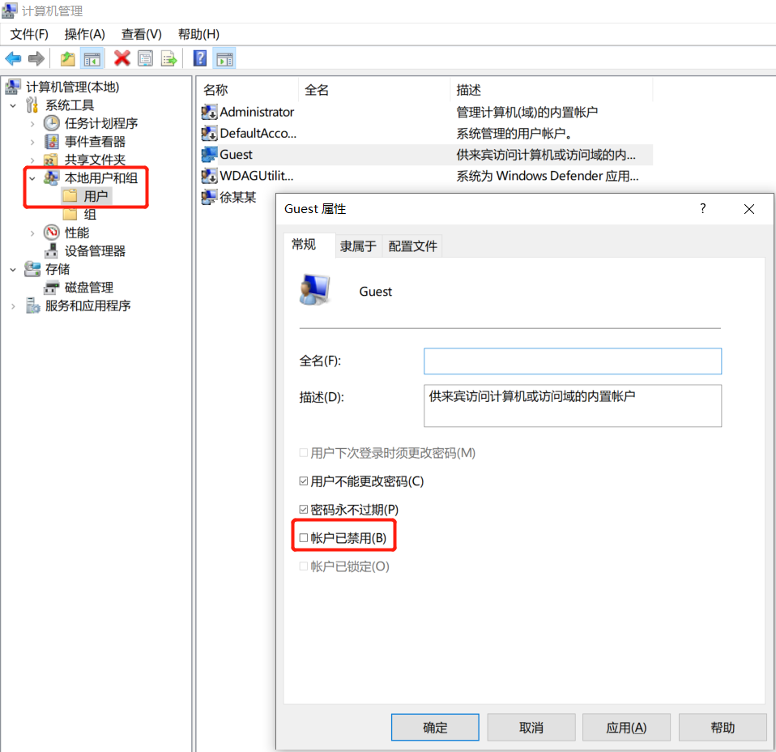

### 二、设置共享目录权限

右击需要共享的目录，点击属性——>共享-共享

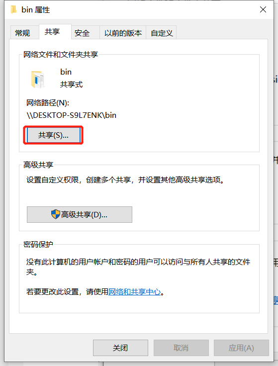

下拉选项选择Everyone——>点击添加——>共享

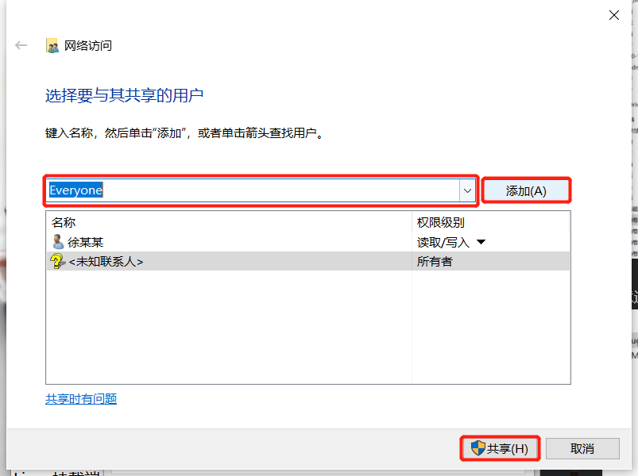
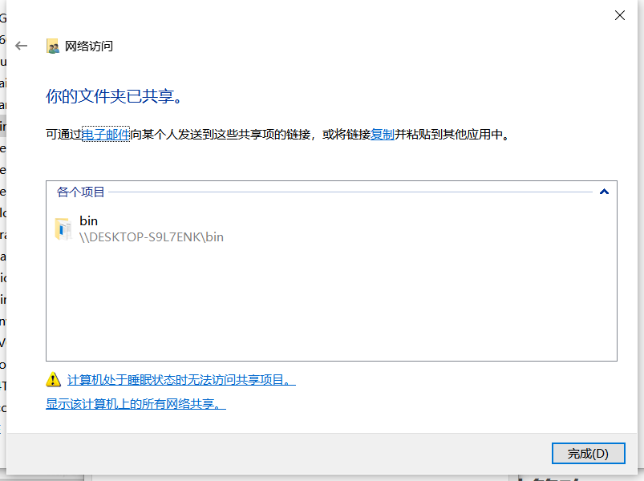

右击需要共享的目录，点击属性——>安全，设置值Everyone 有完全控制权限

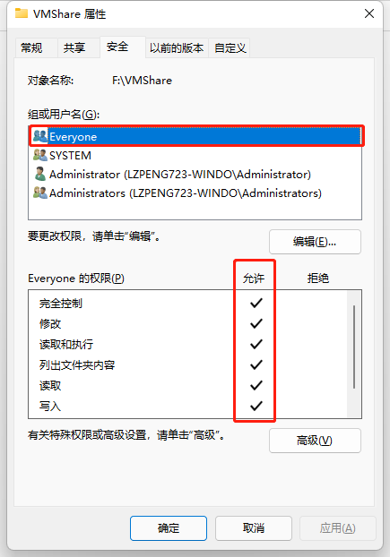

### 三、设置本地策略

打开命令框（窗口键+R）——>输入secpol.msc——>选择本地策略——>用户权限分配——>拒绝从网络访问这台计算机——>删除Guest用户

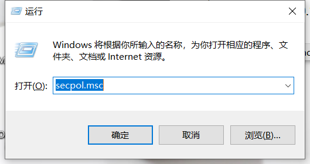
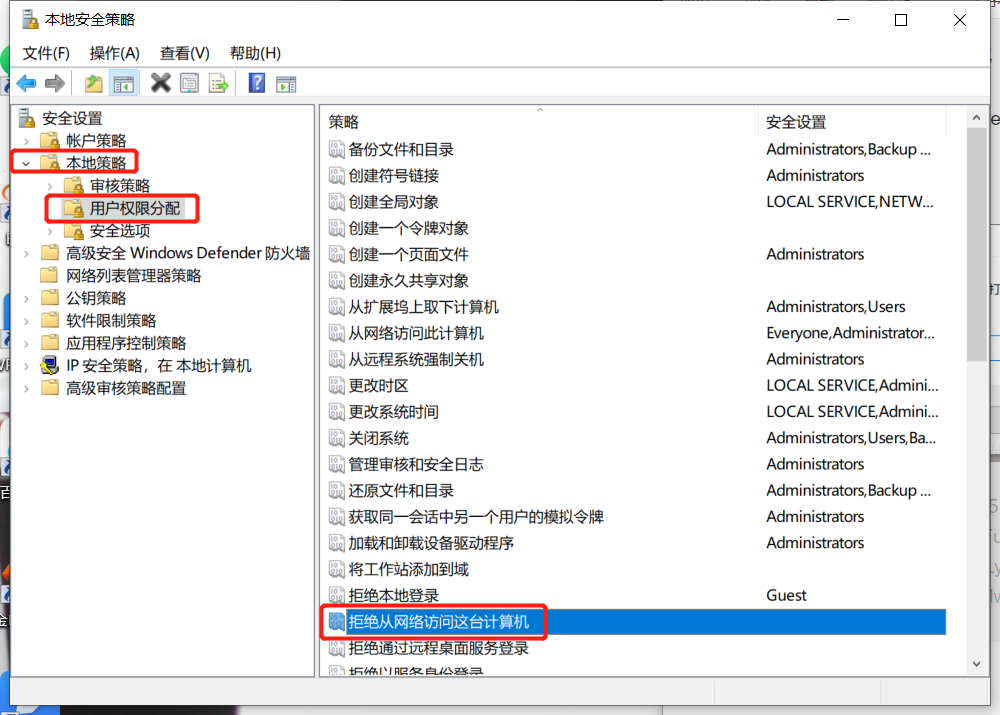

安全选项——>网络访问：本地账户的共享和安全模型——>选择：仅来宾

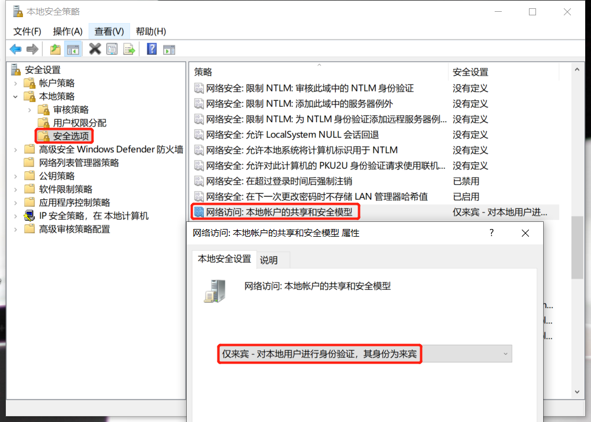

控制面板——>程序——>程序和功能——>启用或关闭 Windows 功能——>勾上所示选项

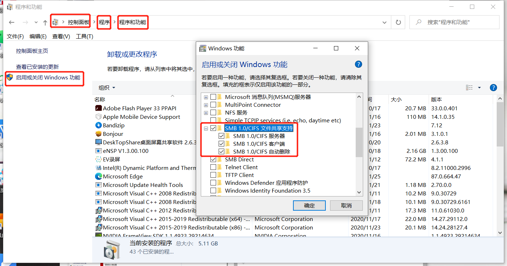

设置完后会重启Windows

### 四、关闭防火墙

要想实现文件共享，你得确定windows和Linux的防火墙处于关闭状态

#### 1.关闭Windows系统防火墙

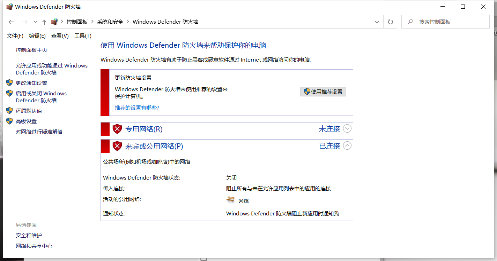

#### 2.关闭Linux系统防火墙

```bash
systemctl stop firewalld
setenforce 0
```

### 五、Linux挂载端

#### 1.扫描共享目录

首先看一下自己的虚拟网卡IP地址

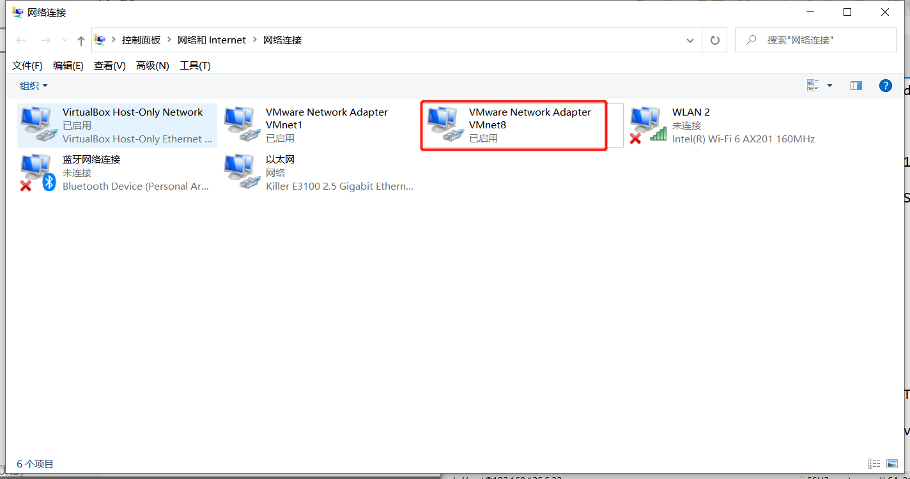
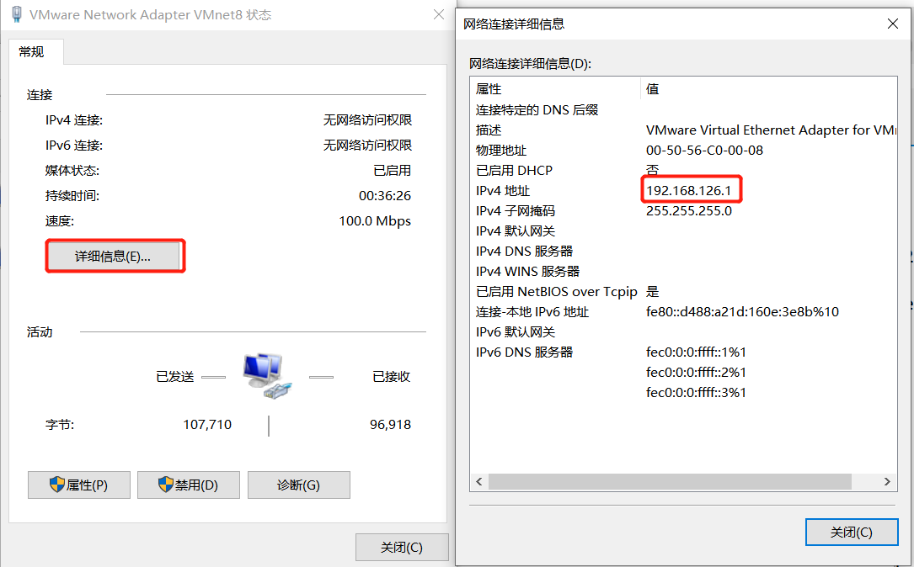

```bash
smbclient -L //192.168.64.1       ##这里填之前查到的IP地址

Enter SAMBA\root's password:        ##不用设置密码，直接回车

        Sharename       Type      Comment
        ---------       ----      -------
        ADMIN$          Disk      远程管理
        C$              Disk      默认共享
        D$              Disk      默认共享
        E$              Disk      默认共享
        F$              Disk      默认共享
        IPC$            IPC       远程 IPC
        VMShare         Disk      
Reconnecting with SMB1 for workgroup listing.
do_connect: Connection to 192.168.64.1 failed (Error NT_STATUS_RESOURCE_NAME_NOT_FOUND)
Unable to connect with SMB1 -- no workgroup available

```

#### 2.挂载共享目录

```bash
rpm -q cifs-utils        ##查看cifs-utils软件是否安装
yum -y install cifs-utils        ##如若没有则安装一下
mkdir -p /mnt/Windows    ## 创建目录
umount /mnt/Windows    ## 取消挂载
mount -t cifs -o username=Everyone,password= //192.168.64.1/VMShare /mnt/Windows    ##挂载共享目录
df -h    # 查看挂载情况
```

#### 3.设置开机自动挂载

```bash
df -T    ## 查看文件系统格式
vim /etc/fstab
## 添加以下一行
//192.168.64.1/VMShare /mnt/Windows cifs defaults,username=Everyone,password= 0 0
## 设置/tmp目录大小
tmpfs /tmp tmpfs nodev,nosuid,size=2G 0 0
```