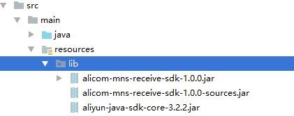

## 如何引入本地jar包

### 在resources下面新建lib文件夹，并把jar包文件放到这个目录下



### 在pom文件定义几个依赖指向刚才引入的文件

```xml
<dependency>
            <groupId>com.aliyun.alicom</groupId>
            <artifactId>alicom-mns-receive-sdk</artifactId>
            <version>0.0.1-SNAPSHOT</version>
            <scope>system</scope>
            <systemPath>${project.basedir}/src/main/resources/lib/alicom-mns-receive-sdk-1.0.0.jar</systemPath>
        </dependency>
        <dependency>
            <groupId>com.aliyun.mns</groupId>
            <artifactId>aliyun-sdk-mns</artifactId>
            <version>1.1.8</version>
            <scope>system</scope>
            <systemPath>${project.basedir}/src/main/resources/lib/aliyun-sdk-mns-1.1.8.jar</systemPath>
        </dependency>
</dependency>
```

注意：重点是systemPath这个路径必须得是你jar的路径。其他的按照套路填就行，要求不是太严格。${project.basedir}只是一个系统自己的常量，不用管它

### 如何把项目打成jar，同时把本地jar包也引入进去

直接在maven的pom里给springboot的打包插件引入一下参数就行

```xml
<includeSystemScope>true</includeSystemScope>
```

总体是这样的

```xml
<build>
    <plugins>
        <plugin>
            <groupId>org.springframework.boot</groupId>
            <artifactId>spring-boot-maven-plugin</artifactId>
            <configuration>
                <includeSystemScope>true</includeSystemScope>
            </configuration>
        </plugin>
    </plugins>
</build>
```