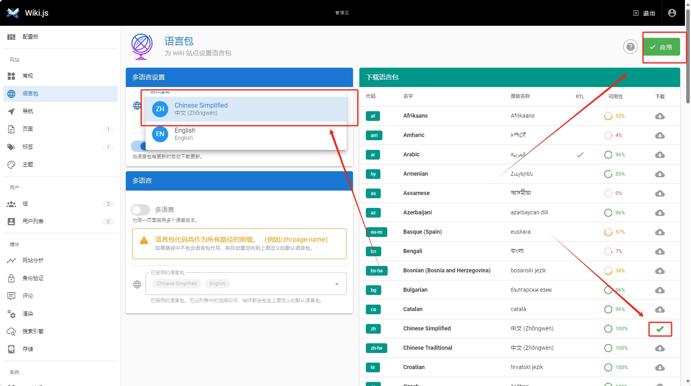
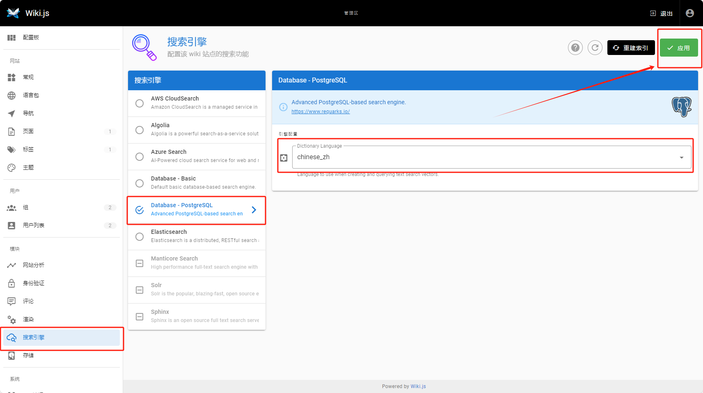
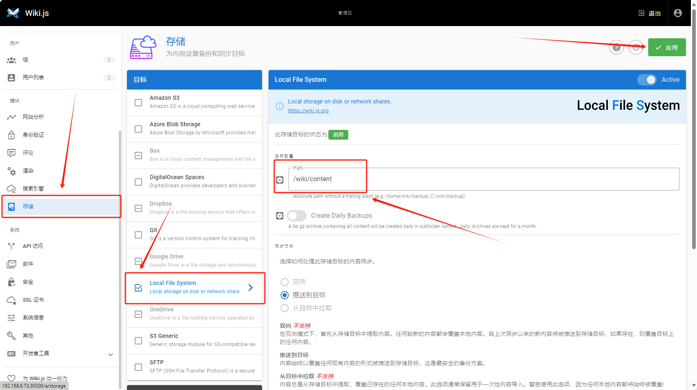
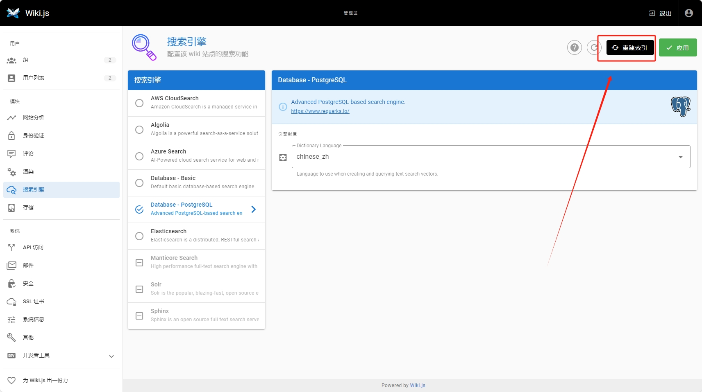

[原文链接](https://blog.csdn.net/fenglailea/article/details/128615789) [wiki官网](https://js.wiki/)


# k8s部署 wiki.js ,带中文分词

## 1.1 k8s postgres 安装

因为包含中文分词，要在原版的基础上增加分词插件,这里直接使用别人已经制作好的镜像

github 地址 : [https://github.com/abcfy2/docker_zhparser](https://github.com/abcfy2/docker_zhparser)

镜像地址： [https://hub.docker.com/r/abcfy2/zhparser](https://hub.docker.com/r/abcfy2/zhparser)

这里选择 `postgres 15` 版本，即 `docker pull abcfy2/zhparser:15-alpine`

那么最后的 `k8s postgres` 配置文件如下

### postgresql-pod.yml

```yml
apiVersion: apps/v1
kind: Deployment
metadata:
  labels:
    app: postgres
  name: postgres
spec:
  replicas: 1
  revisionHistoryLimit: 5
  selector:
    matchLabels:
      app: postgres
  template:
    metadata:
      labels:
        app: postgres
    spec:
      containers:
        - env:
            - name: TZ
              value: Asia/Shanghai
            - name: POSTGRES_USER
              value: fox
            - name: POSTGRES_PASSWORD
              value: '123456'
            - name: ALLOW_IP_RANGE
              value: 0.0.0.0/0
            - name: PGDATA
              value: /var/lib/postgresql/data
          #image: 'postgres:15-alpine'
          # 使用支持 中文分词的 
          image: 'abcfy2/zhparser:15-alpine'
          name: postgres
          imagePullPolicy: IfNotPresent
          ports:
            - containerPort: 5432
              protocol: TCP
#          resources:
#            limits:
#              memory: 2Gi
#            requests:
#              memory: 2Gi
          volumeMounts:
            - name: vm-data
              mountPath: /var/lib/postgresql/data

      restartPolicy: Always
      terminationGracePeriodSeconds: 30
      volumes:
        - name: vm-data
          hostPath:
            # 宿主机目录
            path: /www/websites/postgresql/data
            # hostPath 卷指定 type，如果目录不存在则创建(可创建多层目录)
            type: DirectoryOrCreate
```

### postgresql-svc.yml

```yml
apiVersion: v1
kind: Service
metadata:
  name: postgres
  labels:
    app: postgres
spec:
  type: NodePort
  ports:
    - port: 5432
      targetPort: 5432
      nodePort: 30432
  selector:
    app: postgres
```


>30432 : 为 外部端口
>
>POSTGRES_USER : 数据库账号 fox，默认创建的库名是 同账号名 即 fox
>
>POSTGRES_PASSWORD: 数据库密码 123456

### 应用并生效

```bash
kubectl apply -f postgresql-pod.yaml
kubectl apply -f postgresql-svc.yaml
```

目录设置

```bash
mkdir -p /www/websites/postgresql/data
chmod -R 777 /www/websites/postgresql/data
```

## 配置 wiki 数据库

### 进入pod

```bash
kubectl exec -it `kubectl get pods | grep postgres |  awk '{print $1}'` bash
```

### 创建 wikijs 用户

登录

```bash
# 登陆 fox用户
psql -U fox
```

生成用户，数据库，给用户管理员权限（创建插件用）

```sql
-- 创建用户及密码
CREATE USER wikijs WITH PASSWORD 'wikijs';
-- 创建库及库所属人
CREATE DATABASE wikijs_db OWNER wikijs;
-- 设置权限
GRANT ALL PRIVILEGES ON DATABASE wikijs_db to wikijs;
-- 设置用户为超级用户
ALTER USER wikijs WITH SUPERUSER;
```
最后 `exit` 退出数据库命令行

###  设置 wikijs 用户下配置

登录

```bash
# 登陆 wikijs用户
psql -U wikijs -d wikijs_db
```

表相关操作

```sql
-- 创建扩展表
-- https://docs.requarks.io/en/search/postgres
CREATE EXTENSION pg_trgm;

CREATE EXTENSION zhparser;
CREATE TEXT SEARCH CONFIGURATION pg_catalog.chinese_zh (PARSER = zhparser);
ALTER TEXT SEARCH CONFIGURATION chinese_zh ADD MAPPING FOR n,v,a,i,e,l WITH simple;

-- [二、PostgerSQL全文检索系统之中文支持_jjj的博客-CSDN博客](https://blog.csdn.net/weixin_40746796/article/details/89209316)
-- 忽略标点影响
ALTER ROLE wikijs SET zhparser.punctuation_ignore = ON;
-- 短词复合
ALTER ROLE wikijs SET zhparser.multi_short = ON;

-- 看看 chinese_zh 在不在
\dF
-- 测试一下
select ts_debug('chinese_zh', '白垩纪是地球上海陆分布和生物界急剧变化、火山活动频繁的时代');
```
最后 `exit` 退出数据库命令行

登录 fox 用户

```bash
# 登陆 fox用户
psql -U fox -d fox
```

表相关操作

```sql
-- UPDATE：之前提示 pg_catalog 没权限，这里再执行一次！
CREATE TEXT SEARCH CONFIGURATION pg_catalog.chinese_zh (PARSER = zhparser);
ALTER USER wikijs WITH NOSUPERUSER;
```

最后 `exit` 退出数据库命令行

到此数据库配置完成

## k8s 配置 wiki

### wiki-pod.yml

```yml
apiVersion: apps/v1
kind: Deployment
metadata:
  labels:
    app: wiki
  name: wiki
spec:
  replicas: 1
  revisionHistoryLimit: 5
  selector:
    matchLabels:
      app: wiki
  template:
    metadata:
      labels:
        app: wiki
    spec:
      containers:
        - env:
            - name: TZ
              value: Asia/Shanghai
            - name: DB_USER
              value: fox
            - name: DB_PASS
              value: '123456'
            - name: DB_NAME
              value: wikijs_db
            - name: DB_HOST
              value: postgres
            - name: DB_TYPE
              value: postgres
            - name: DB_PORT
              value: "5432"
          image: 'ghcr.io/requarks/wiki:2'
          name: wiki
          imagePullPolicy: IfNotPresent
          ports:
            - containerPort: 3000
              protocol: TCP
#          resources:
#            limits:
#              memory: 2Gi
#            requests:
#              memory: 2Gi
          volumeMounts:
            - name: vm-data
              mountPath: /wiki/data
            - name: vm-content
              mountPath: /wiki/content

      restartPolicy: Always
      terminationGracePeriodSeconds: 30
      volumes:
        - name: vm-data
          hostPath:
            # 宿主机目录
            path: /www/websites/wiki/data
            # hostPath 卷指定 type，如果目录不存在则创建(可创建多层目录)
            type: DirectoryOrCreate
        - name: vm-content
          hostPath:
            # 宿主机目录
            path: /www/websites/wiki/content
            # hostPath 卷指定 type，如果目录不存在则创建(可创建多层目录)
            type: DirectoryOrCreate
```

### wiki-svc.yml

```yml
apiVersion: v1
kind: Service
metadata:
  name: wiki
  labels:
    app: wiki
spec:
  type: NodePort
  ports:
    - port: 3000
      targetPort: 3000
      nodePort: 30300
  selector:
    app: wiki
```

>30300 : 为 外部端口
>
>外部浏览器访问 http://ip:30300 即可打开 wiki.js


### 应用并生效

```bash
kubectl apply -f wiki-pod.yml
kubectl apply -f wiki-svc.yml
```

目录设置

```bash
mkdir -p /www/websites/wiki/data
mkdir -p /www/websites/wiki/content
chmod -R 777 /www/websites/wiki/data
chmod -R 777 /www/websites/wiki/content
```

## 设置 wiki 可以使用中文分词

进入 pod 内部

```bash
kubectl exec -it `kubectl get pods | grep wiki |  awk '{print $1}'` bash
```

显示 `definition.yml` 文件内容，

```bash
cat /wiki/server/modules/search/postgres/definition.yml
```

把上面显示的内容复制到主机 `/www/websites/wiki/search/definition.yml` 文件中，如果没有目录的，要先创建好目录或文件
修改 `/www/websites/wiki/search/definition.yml` 文件 ，案例如下
主要是在 `- turkish` 下面一行增加 `- chinese_zh` 格式要一致

请不要直接复制以下案例内容，因为有的版本该文件会增加其他功能字段

```yml
key: postgres
title: Database - PostgreSQL
description: Advanced PostgreSQL-based search engine.
author: requarks.io
logo: https://static.requarks.io/logo/postgresql.svg
website: https://www.requarks.io/
isAvailable: true
props:
  dictLanguage:
    type: String
    title: Dictionary Language
    hint: Language to use when creating and querying text search vectors.
    default: english
    enum:
      - simple
      - danish
      - dutch
      - english
      - finnish
      - french
      - german
      - hungarian
      - italian
      - norwegian
      - portuguese
      - romanian
      - russian
      - spanish
      - swedish
      - turkish
      - chinese_zh
    order: 1
```

修改 pod 配置

新增 `wiki-pod-new.yml` 文件

```yml
apiVersion: apps/v1
kind: Deployment
metadata:
  labels:
    app: wiki
  name: wiki
spec:
  replicas: 1
  revisionHistoryLimit: 5
  selector:
    matchLabels:
      app: wiki
  template:
    metadata:
      labels:
        app: wiki
    spec:
      containers:
        - env:
            - name: TZ
              value: Asia/Shanghai
            - name: DB_USER
              value: fox
            - name: DB_PASS
              value: '123456'
            - name: DB_NAME
              value: wikijs_db
            - name: DB_HOST
              value: postgres
            - name: DB_TYPE
              value: postgres
            - name: DB_PORT
              value: "5432"
          image: 'ghcr.io/requarks/wiki:2'
          name: wiki
          imagePullPolicy: IfNotPresent
          ports:
            - containerPort: 3000
              protocol: TCP
#          resources:
#            limits:
#              memory: 2Gi
#            requests:
#              memory: 2Gi
          volumeMounts:
            - name: vm-data
              mountPath: /wiki/data
            - name: vm-content
              mountPath: /wiki/content
            - name: vm-definition
              mountPath: /wiki/server/modules/search/postgres/definition.yml
      restartPolicy: Always
      terminationGracePeriodSeconds: 30
      volumes:
        - name: vm-data
          hostPath:
            # 宿主机目录
            path: /www/websites/wiki/data
            # hostPath 卷指定 type，如果目录不存在则创建(可创建多层目录)
            type: DirectoryOrCreate
        - name: vm-content
          hostPath:
            # 宿主机目录
            path: /www/websites/wiki/content
            # hostPath 卷指定 type，如果目录不存在则创建(可创建多层目录)
            type: DirectoryOrCreate
        - name: vm-definition
          hostPath:
            path: /www/websites/wiki/search/definition.yml
            type: FileOrCreate
```

### 应用并生效

```bash
kubectl delete -f wiki-pod.yml
kubectl apply -f wiki-pod-new.yml
```

## 配置 wiki

通过域名打开 `http://ip:30300` ,开始配置wiki。配置管理员邮箱、密码、wiki登录地址。

### 配置中文

如果要配置语言为中文的的，在这个页面下 `http://ip:30300/a/locale`



### 配置中文搜索

wiki.js -> 管理 -> 搜索引擎 -> Database - PostgreSQL -> Dictionary Language 

选 chinese_zh



### 配置文件存储

如果不配置，那么文件创建，或者上传文件会在pod容器内部，无法持久话，会丢失附件
配置板 -> 存储 -> Local File System -> 目标配置
内容修改为 `/wiki/content`
最后应用并生效



此时就可以使用全文检索了，如果检索不到，可以进行手动更新索引


