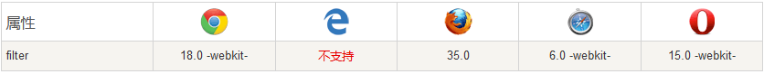

听起来是不是不可思议？但是真的是一行代码就可以实现的，我是在无意之间发现了这个神奇的代码，在这里分享给大家，也感谢那些无私的大神分享。

```css
html {
    -webkit-filter: grayscale(95%);
    -moz-filter: grayscale(95%);
    -ms-filter: grayscale(95%);
    -o-filter: grayscale(95%);
    filter: grayscale(95%);
    filter: progid:DXImageTransform.Microsoft.BasicImage(grayscale=0.95);
}
```

## 什么filter CSS 属性呢？

是将模糊或颜色偏移等图形效果应用于元素。滤镜通常用于调整图像，背景和边框的渲染。简单的说就是通过 filter 样式改变了图片、颜色、模糊、对比度等等信息

注意: 滤镜通常使用百分比 (如：75%), 当然也可以使用小数来表示 (如：0.75)。

浏览器支持




**注意:** 旧版 Internet Explorer 浏览器(4.0 to 8.0) 支持的非标准 "filter" 属性已被废弃。 IE8 及更低版本浏览器通常使用 [opacity](https://www.runoob.com/cssref/css3-pr-opacity.html) 属性。

除了grayscale，还有很多其他的属性值，可以动手试试。

比如这里如果我们可以使用 blur 设置高斯模糊，用法如下：

```css
img {
    -webkit-filter: blur(5px); /* Chrome, Safari, Opera */
    filter: blur(5px);
}
```

图片使用高斯模糊效果如下：


各个用法介绍大家可以参考
[菜鸟教程的文档说明](https://www.runoob.com/cssref/css3-pr-filter.html)
[MDN grayscale()](https://developer.mozilla.org/zh-CN/docs/Web/CSS/filter-function/grayscale())
