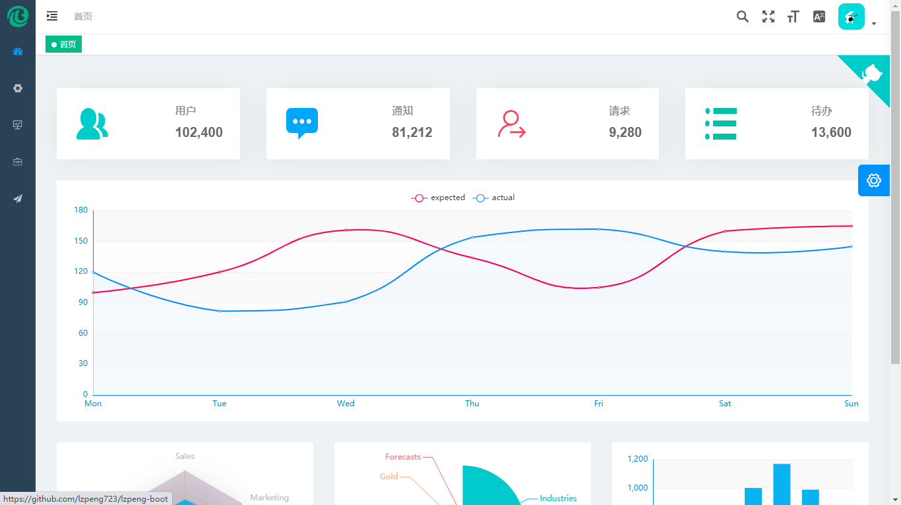
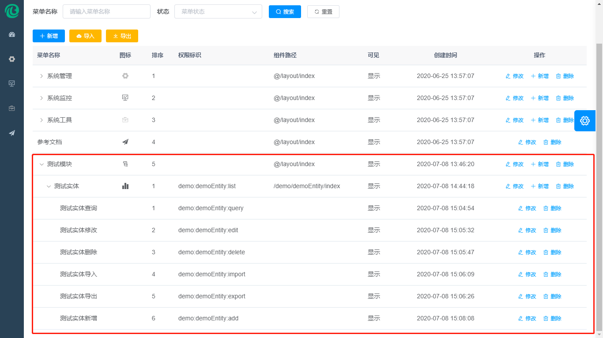

# 后端手册

## 项目模块

这里演示使用 IDEA 创建一个新的子模块

### 新建模块

点击 File -> New -> Module...


点击Next


父模块选择 minimal-modules, 给本模块命名, 点击 Finish


给本模块写上中文名和中文介绍,并将 minimal-system 的依赖拷贝到本模块


将 minimal-system 的配置文件 application.yml 拷贝到本模块, 并修改端口


新建 Spring Boot 启动类


```java
package com.lzpeng.minimal.demo;

import org.springframework.boot.SpringApplication;
import org.springframework.boot.autoconfigure.SpringBootApplication;

/**
 * Demo模块 启动类
 * @author : Lzpeng
 */
@SpringBootApplication
public class DemoApplication {

    public static void main(String[] args) {
        SpringApplication.run(DemoApplication.class, args);
    }

}
```

新建数据库

```sql
create DATABASE `你的模块名` DEFAULT CHARACTER SET utf8 COLLATE utf8_general_ci;
```

### 新增实体
::: tip
实体类必须放到 .domain.entity 包下
:::

新增实体 DemoEntity

```java
package com.lzpeng.minimal.demo.domain.entity;

import com.lzpeng.minimal.common.core.annotation.Excel;
import com.lzpeng.minimal.common.core.annotation.GenerateCode;
import com.lzpeng.minimal.common.jpa.domain.entity.BaseEntity;
import io.swagger.annotations.ApiModel;
import io.swagger.annotations.ApiModelProperty;
import lombok.Data;
import lombok.EqualsAndHashCode;
import lombok.ToString;
import org.hibernate.annotations.DynamicInsert;
import org.hibernate.annotations.DynamicUpdate;

import javax.persistence.Column;
import javax.persistence.Entity;
import javax.validation.constraints.NotBlank;
import javax.validation.constraints.Size;

/**
 * @author : Lzpeng
 */
@Data
@Entity
@ApiModel("测试实体")
@DynamicInsert
@DynamicUpdate
@ToString(callSuper = true)
@EqualsAndHashCode(callSuper = true)
@GenerateCode(editPage = GenerateCode.PageType.DIALOG)
public class DemoEntity extends BaseEntity {

    /**
     * 名称
     */
    @NotBlank
    @Excel(name = "名称")
    @ApiModelProperty("名称")
    @Column(columnDefinition = "varchar(255) COMMENT '名称'")
    private String name;
    /**
     * 编码
     */
    @Size(min = 6, max = 16, message = "编码必须为6-16位之间")
    @ApiModelProperty("编码")
    @Column(columnDefinition = "varchar(255) COMMENT '编码'", unique = true)
    private String number;

}
```

### 生成代码

在 DemoApplication 类上按 Alt + Enter 选择 Create Test


```java
package com.lzpeng.minimal.demo;

import com.lzpeng.minimal.generate.core.AbstractCodeGenerator;
import com.lzpeng.minimal.generate.jpa.JpaCodeGenerator;
import org.junit.jupiter.api.Test;

import static org.junit.jupiter.api.Assertions.*;

/**
 * @author : Lzpeng
 */
class DemoApplicationTest {

    @Test
    void testGenFile(){
        AbstractCodeGenerator generator = new JpaCodeGenerator();
        generator.generateAllCode();
    }

}
```

运行测试用例,生成代码


运行完毕后会生成 Controller, Service, Dao, 测试用例和前端页面,如下图所示


运行测试用例


可能会出现 ```nested exception is java.lang.IllegalArgumentException: Did not find a query class com.lzpeng.minimal.demo.domain.entity.QDemoEntity for domain class com.lzpeng.minimal.demo.domain.entity.DemoEntity!```,是因为没有生成QueryDSL的类, 可以```mvn compile```一下。


再次运行测试用例就会运行成功,说明后端代码没有问题


将生成的前端文件放置前端项目中


在网关模块配置文件(./minimal-gateway/src/main/resources/application-gateway.yml)添加如下配置

```yaml
        - id: minimal-demo
          uri: lb://minimal-demo
          predicates:
            - Path=/demo/**
```

::: tip
注意缩进空格(TAB),缩进不对会导致项目启动失败
:::

配置完成之后如下图所示


### 发布菜单

启动 Nacos, Sentinel, Zipkin

[启动所有微服务](./img/guide/quick-start.html#后端运行idea)和[前端项目](./img/guide/quick-start.html#前端运行webstorm),然后使用系统管理员登录系统



选择 系统管理 -> 菜单管理 -> 新增菜单

新增菜单组


新增菜单项


新增权限项


最终效果:



分配权限


退出系统,重新登录,测试新模块


测试增删改查均无问题


## 权限控制

权限控制采用Spring Security,待补充

### 权限控制

权限控制采用Spring Security,待补充

### 数据交互

权限控制采用Spring Security,待补充

### 权限注解

权限控制采用Spring Security,待补充

### 接口放行

权限控制采用Spring Security,待补充

## 通用查询

ORM框架采用Spring Data JPA,待补充

### JPA查询

ORM框架采用Spring Data JPA,待补充

### Query DSL查询

ORM框架采用Spring Data JPA,待补充

## 系统缓存

缓存采用Spring Cache,待补充

### 配置缓存

缓存采用Spring Cache,待补充

### 缓存注解

缓存采用Spring Cache,待补充

### 使用建议

缓存采用Spring Cache,待补充