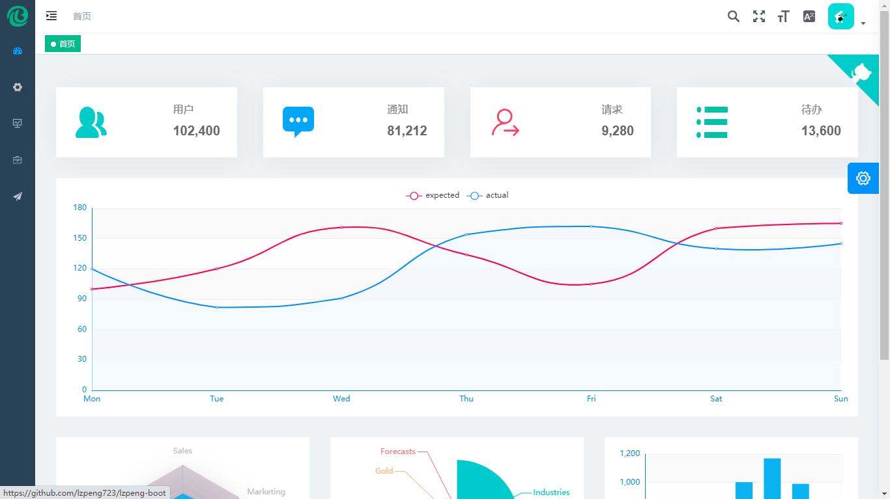
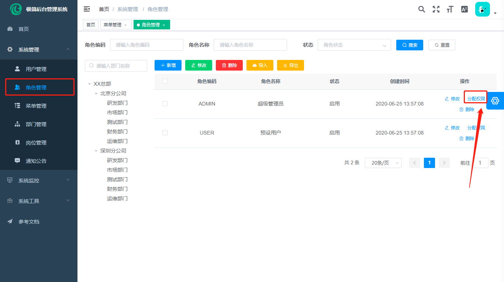
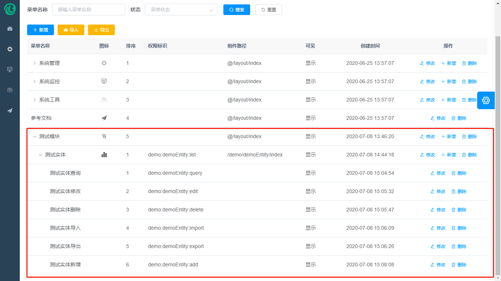

# 项目介绍 
# 
MINIMAL-CLOUD 后台管理系统(微服务版)

## 平台简介

* 采用前后端分离的模式，基于单体架构([minimal-boot](https://github.com/lzpeng723/minimal-boot))。
* 后端采用Spring Boot、Spring Cloud & Alibaba。
* 注册中心、~~配置中心选型 Nacos，~~权限认证使用 OAuth2。
* 流量控制框架选型 Sentinel。
* 链路追踪框架选型 Zipkin。
* ~~分布式事务框架选型 Seata。~~
* 如需单体架构，请移步 [minimal-boot](https://github.com/lzpeng723/minimal-boot)。
## 在线体验

- admin/mcadmin
- user/mcuser

演示地址：~~[http://lzpeng723.github.io/minimal-cloud](http://lzpeng723.github.io/minimal-cloud)~~

文档地址：[http://lzpeng723.github.io/minimal-cloud](http://lzpeng723.github.io/minimal-cloud)

## 演示图

