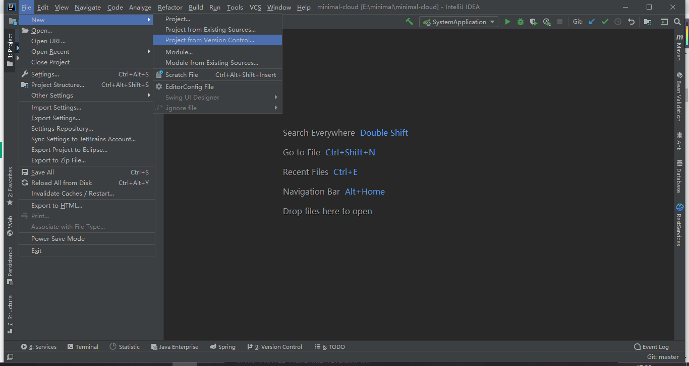
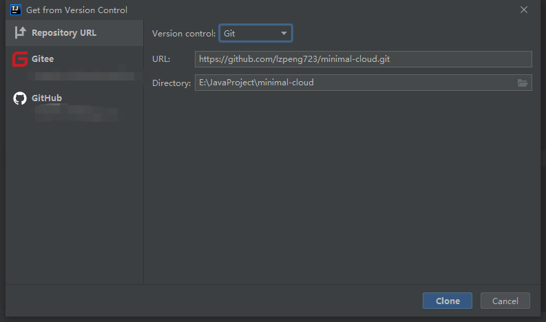
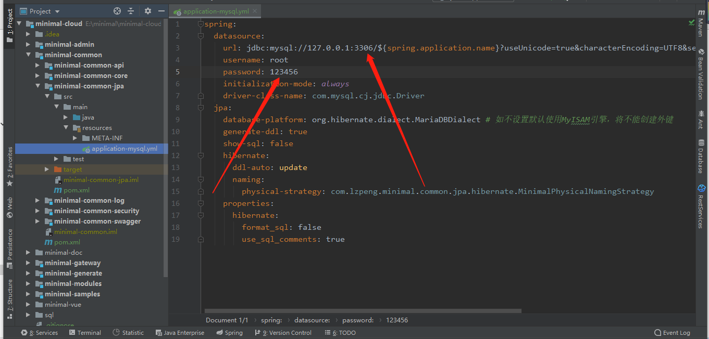
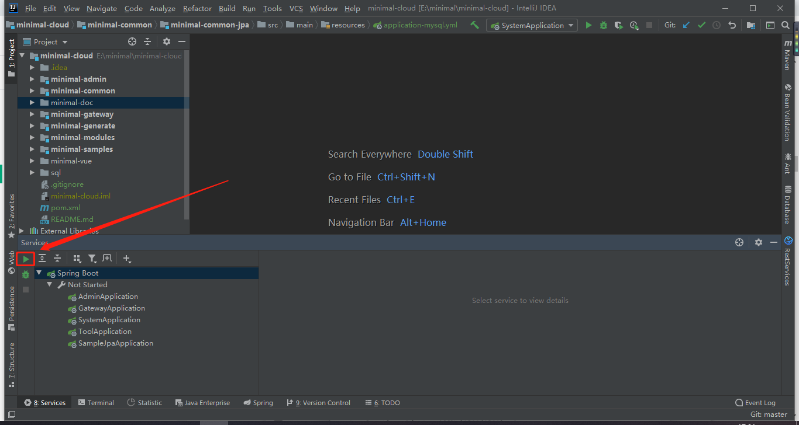
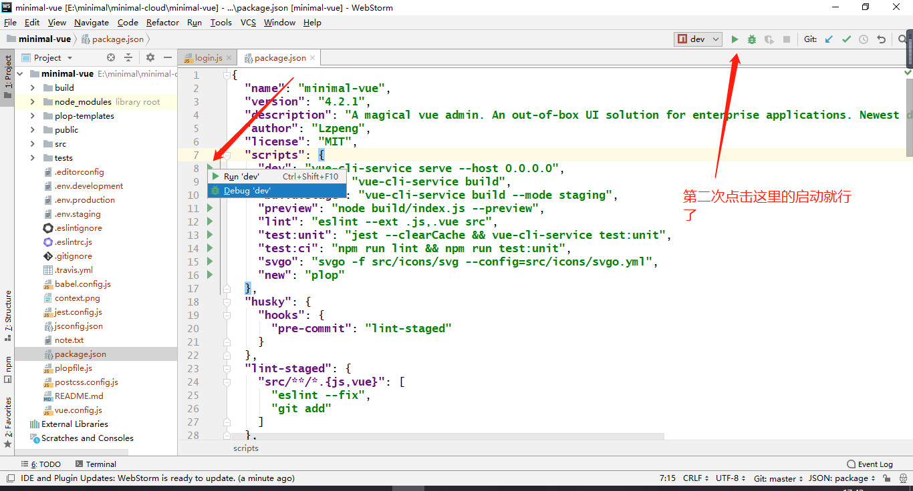

# 快速开始

使用该项目前, 你需要检查你本地的开发环境, 避免出现问题

## 所需环境

这里列出项目所需的环境与相关安装教程,方便刚入门的同学

```
1、JDK: 1.8+ 
安装教程: https://www.runoob.com/java/java-environment-setup.html
2、Redis 3.0+
安装教程: https://www.runoob.com/redis/redis-install.html
3、Maven 3.0+
安装教程: https://www.runoob.com/maven/maven-setup.html
4、MYSQL 5.5.0+
安装教程: https://www.runoob.com/mysql/mysql-install.html
5、Node v10+
安装教程: https://www.runoob.com/nodejs/nodejs-install-setup.html
6、Nacos Server 1.2.1
下载地址: https://github.com/alibaba/nacos/releases/tag/1.2.1
7、Sentinel Dashboard 1.7.1
下载地址: https://github.com/alibaba/Sentinel/releases/tag/1.7.1
8、ZipKin Server 2.12.9
下载地址: https://repo1.maven.org/maven2/io/zipkin/java/zipkin-server/2.12.9/zipkin-server-2.12.9-exec.jar
9、IDEA
安装教程: https://mp.weixin.qq.com/s/AJTR5gEgNRp_hQ9X3zpMEg
10、WebStorm
安装教程: https://mp.weixin.qq.com/s/GQjjhtmLkilacNPwCR_rHw
```

::: tip
安装完 maven 后,最好设置下淘宝的镜像源
:::

打开maven安装目录./conf/setting.xml文件
大概53行的位置添加maven下载jar包存放位置

```xml
<localRepository>E:/libs/maven</localRepository>
```

大概150行的位置添加淘宝镜像源

```xml
<mirror>
    <id>alimaven</id>
    <name>aliyun maven</name>
    <url>http://maven.aliyun.com/nexus/content/groups/public/</url>
    <mirrorOf>central</mirrorOf>        
</mirror>
```

::: tip
安装完 node 后,最好设置下淘宝的镜像源,全局安装 cnpm
:::

```
# 更改使用指定镜像（淘宝）
npm config set registry https://registry.npm.taobao.org
# 设置npm下载包路径并手动将设置的路径添加到环境变量Path中
npm config set prefix "E:\libs\nodejs\npm"
# 设置npm缓存包路径
npm config set cache "E:\libs\nodejs\npm\cache"
# 全局安装 cnpm, yarn, @vue/cli 和 windows-build-tools
# 使用淘宝cnpm代替原生npm
npm install -g cnpm
# 使用yarn代替原生npm
npm install -g yarn
# 开发vue项目的脚手架
npm install -g @vue/cli
# Node.js 在安装模块的时候可能会报缺少python环境的错
npm install --global --production windows-build-tools
```

## 开发准备

::: tip
在使用该系统前, 你还需要做如下准备
:::

1、给 [idea](https://blog.csdn.net/wochunyang/article/details/81736354) 或者 [eclipse](https://blog.csdn.net/magi1201/article/details/85995987) 安装 lombok 插件, 我们用它可以省略get, set 方法, 可以使代码更简洁,  具体查看 [lombok](https://www.zhihu.com/question/42348457) 教程

~~2、了解MapStruct, 项目用到了他映射实体, 如果你不熟悉可以查看: [熟悉MapStruct](https://www.jianshu.com/p/3f20ca1a93b0)~~

3、你需要有 Spring boot, Spring Cloud Alibaba的基础, 推荐教程 [Spring Boot 2.0 学习](https://github.com/ityouknow/spring-boot-examples) [Spring Cloud Alibaba 学习](https://github.com/alibaba/spring-cloud-alibaba/blob/master/README-zh.md)

4、你还需要有 Vue 和 ElementUI 的基础, 推荐 [Vue 文档](https://cn.vuejs.org/), [ElementUI 文档](https://element.eleme.cn/#/zh-CN/component/installation), [vue-element-admin文档](https://panjiachen.github.io/vue-element-admin-site/zh/)

## 运行项目

::: tip
因为本项目是微服务架构前后端分离的,所以需要前后端都启动好,才能进行访问
:::

### 后端运行IDEA

打开IDEA,直接导入 Git 项目



输入我们的 Git 地址

```
https://github.com/lzpeng723/minimal-cloud.git
```



打开数据库,导入sql文件夹中的初始化脚本库脚本 minimal-cloud .sql

修改配置,如果你的数据库密码不是 123456,那么需要在 ./minimal-common/minimal-common-jpa/src/main/resources/application-mysql.yml 配置文件中做相应的修改



启动 Nacos, Sentinel, Zipkin

运行项目: 找到 services 面板,选中Spring Boot 运行所有微服务



### 前端运行WebStorm

打开 minimal-vue 文件夹,安装依赖

```
cnpm install
```

若提示未找到 cnpm 命令,参见[所需环境](#所需环境)的第二个 tip

打开 WebStorm,导入我们的项目,打开 package.json 找到 dev 旁边的启动按钮



启动完后打开 [localhost:9527](http://localhost:9527) 即可

### 前端运行常见问题

1、依赖安装失败

```
在 ~/.npmrc 加入下面内容,可以避免安装 node-sass 失败
sass_binary_site=https://npm.taobao.org/mirrors/node-sass/

.npmrc 文件位于
win：C:\Users\[你的账户名称]\.npmrc
linux：直接使用 vi ~/.npmrc
```

2、linux 系统在安装依赖的时候会出现 node-sass 无法安装的问题

```
1. 单独安装: npm install --unsafe-perm node-sass 
2. 直接使用: npm install --unsafe-perm
```
